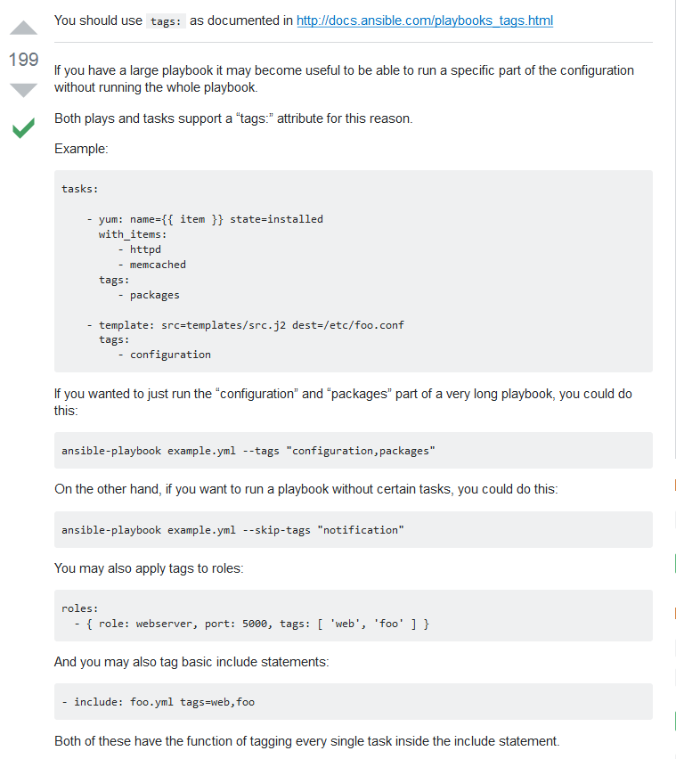

**********
Ansible
**********

*Some useful links to explain the concepts of Ansible*

#########
Concepts
#########
- https://blog.josephkahn.io/articles/ansible/

- http://engineering.waveapps.io/post/80595462671/an-ansible-primer

- http://tjheeta.github.io/2015/04/15/ansible-vs-chef/

- https://andidog.de/blog/2017-04-24-ansible-best-practices

##########################
Official Documentation
##########################
- https://docs.ansible.com/ansible/2.4/index.html

##################
Configuration
##################

Ansible.cfg
############
- https://raw.githubusercontent.com/ansible/ansible/devel/examples/ansible.cfg

- http://techadminblog.com/get-execution-time-of-each-task-ansible/

- https://blog.ssdnodes.com/blog/step-by-step-ansible-guide/

- https://stackoverflow.com/questions/27733511/how-to-set-linux-environment-variables-with-ansible

Run one Task - Ansible Playbook
################################
- https://stackoverflow.com/questions/23945201/how-to-run-only-one-task-in-ansible-playbook

Basic Ansible Tutorials
################################
- https://serversforhackers.com/c/an-ansible2-tutorial

- https://leucos.github.io/ansible-files-layout

- https://www.linode.com/docs/applications/configuration-management/automatically-configure-servers-with-ansible-and-playbooks/

- https://www.digitalocean.com/community/tutorials/how-to-manage-multistage-environments-with-ansible

- http://codeheaven.io/15-things-you-should-know-about-ansible/

- https://symfonycasts.com/screencast/ansible/handlers

Ansible Roles
##############
- https://www.digitalocean.com/community/tutorials/how-to-use-ansible-roles-to-abstract-your-infrastructure-environment

Managing Users with Ansible
################################
- https://www.alibabacloud.com/blog/managing-system-users-using-ansible_593861

- https://serverfault.com/questions/830302/ensure-only-specific-list-of-users-exist-with-ansible

- http://minimum-viable-automation.com/ansible/managing-users-accounts-ansible/

NGinx Setup via Ansible
################################
- https://symfonycasts.com/screencast/ansible/nginx-conf-template

- https://blog.serverdensity.com/deploying-nginx-with-ansible/

- https://meritocracy.is/blog/2017/07/24/manage-nginx-configurations-ansible/

- https://liquidat.wordpress.com/2016/01/26/howto-introduction-to-ansible-variables/

- https://mydbops.wordpress.com/2019/04/17/jinja2-for-better-ansible/

##################
Troubleshooting
##################
- https://stackoverflow.com/questions/20563639/ansible-playbook-shell-output

- https://docs.ansible.com/ansible/latest/user_guide/playbooks_delegation.html

- https://docs.ansible.com/ansible/latest/user_guide/playbooks_filters.html