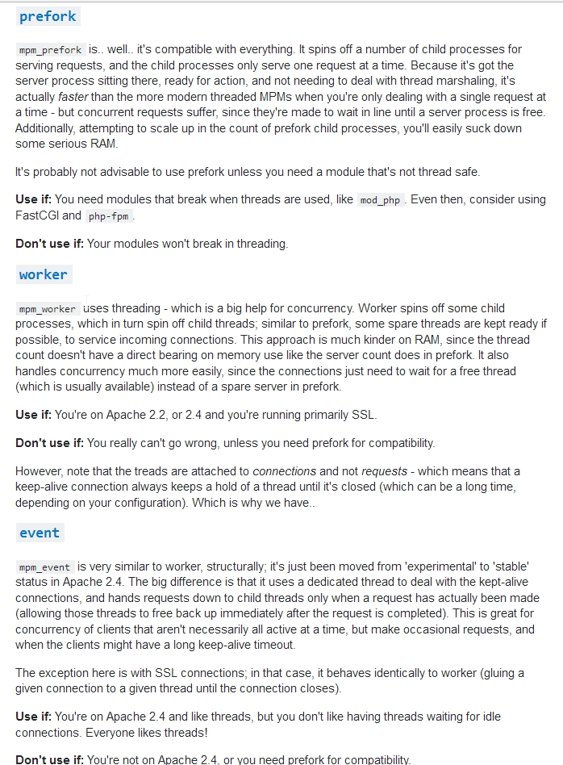

Apache
************

*Some useful links to cover the basics of Apache

########
Concepts
########

- http://code.tutsplus.com/tutorials/an-introduction-to-apache--net-25786
    
- http://fideloper.com/quick-caching-explanation
   
- https://anturis.com/blog/get-insight-into-your-website-performance-with-key-apache-statistics/
   
- http://middlewaretechnologies.blogspot.in/2013/04/have-you-ever-tried-installing-apache.html

Information about MPM (Multi Processing Modules)
################################################

- https://prakash-khadka.com.np/apache-mpm/
   
- http://articles.slicehost.com/2010/12/3/configuring-the-apache-mpm-on-gentoo

- https://serverfault.com/questions/383526/how-do-i-select-which-apache-mpm-to-use

################
Configuration
################

- http://fideloper.com/ubuntu-12-04-lamp-server-setup
   
- https://www.linode.com/docs/websites/apache/apache-web-server-on-centos-6
   
- https://www.linode.com/docs/websites/lamp/lamp-on-centos-6/
   
- http://www.erikwebb.net/blog/compile-and-install-apache-24-red-hat-enterprise-linux-rhel-6-or-centos-6/

- https://www.digitalocean.com/community/tutorials/how-to-install-linux-apache-mysql-php-lamp-stack-on-centos-6
   
- http://shapeshed.com/domain_forwarding_in_apache/
   
- https://www.linode.com/docs/websites/apache-tips-and-tricks/redirect-urls-with-the-apache-web-server
   
- http://www.tecmint.com/creating-your-own-webserver-and-hosting-a-website-from-your-linux-box/
   
- https://serversforhackers.com/video/php-fpm-configuration-the-listen-directive
   
- https://coderwall.com/p/hmsr5a/have-php-fpm-listen-on-unix-socket

Virtual Hosting
#################
- http://www.thegeekstuff.com/2011/07/apache-virtual-host/
   
- https://support.rackspace.com/how-to/how-to-serve-multiple-domains-using-virtual-hosts/
   
- https://mobile.serverwatch.com/tutorials/article.php/1127571/Apache-Guide-Setting-Up-Virtual-Hosts.htm
   
- https://serversforhackers.com/configuring-apache-virtual-hosts
   
- http://www.thegeekstuff.com/2011/07/apache-virtual-host/

- https://www.digitalocean.com/community/tutorials/how-to-set-up-apache-virtual-hosts-on-centos-6
   
- https://www.digitalocean.com/community/tutorials/how-to-create-a-ssl-certificate-on-apache-for-centos-6
   
- http://aarvik.dk/good-apache-virtualhost/

HTaccess checks and guides
###########################
- http://www.htaccesscheck.com/
 
- http://htaccess.madewithlove.be/
   
- http://www.askapache.com/htaccess/htaccess.html
 
- http://socreativedigital.com/7-htaccess-file-examples-that-work-for-seo-2013-05-04

#######################
Tuning & Hardening
#######################

Apache Server Status Page
###############################
- http://www.tecmint.com/monitor-apache-web-server-load-and-page-statistics/
   
- http://www.coscale.com/blog/apache-troubleshooting-and-monitoring
   
- https://anturis.com/blog/get-insight-into-your-website-performance-with-key-apache-statistics/
   
- https://blog.serverdensity.com/monitor-apache/

Other Optimizations
###################
- http://www.tecmint.com/apache-performance-tuning/
   
- http://www.ubuntufree.com/how-to-optimize-apache/
   
- https://www.maketecheasier.com/series/apache-server-guide/
   
- http://linuxbsdos.com/2015/02/17/how-to-reduce-php-fpm-php5-fpm-ram-usage-by-about-50/
   
- http://blog.chrismeller.com/configuring-and-optimizing-php-fpm-and-nginx-on-ubuntu-or-debian
   
- https://serversforhackers.com/video/php-fpm-process-management
   
- http://linuxconfig.org/apache-web-server-ssl-authentication
   
- https://geekflare.com/apache-web-server-hardening-security/
   
- https://geekflare.com/category/web-infrastructure/apache/
   
- http://www.acunetix.com/blog/articles/10-tips-secure-apache-installation/
   
- http://www.tecmint.com/apache-security-tips/
   
- http://www.thegeekstuff.com/2011/03/apache-hardening/
   
- https://haydenjames.io/strip-apache-improve-performance-memory-efficiency/
   
- http://www.serverlab.ca/tutorials/linux/web-servers-linux/configuring-selinux-policies-for-apache-web-servers/
   
- http://geekflare.com/apache-web-server-hardening-security/

################################   
Troubleshooting & Log Parsing
################################

Find Original IPs of sites using CDNs like Cloudflare
##############################################################
- https://censys.io/
    
Levels of traffic with Apache access log
##########################################################
- http://www.inmotionhosting.com/support/website/server-usage/view-level-of-traffic-with-apache-access-log

- http://www.inmotionhosting.com/support/website/website-troubleshooting/determine-cause-of-server-usage-spike
   
- http://www.cyberciti.biz/faq/apache-logs/
   
- http://www.serverwatch.com/tutorials/article.php/1127521/Apache-Guide-Logging-with-ApacheUnderstanding-Your-accesslog.htm
   
- http://list.xmodulo.com/web-server-benchmarking-tools-linux.html
   
- http://stackoverflow.com/questions/9234699/understanding-apache-access-log
   
- http://logz.io/blog/apache-log-analyzer/
   
- http://www.the-art-of-web.com/system/logs/

##########
Commands
##########

- **Find hits by IP to server from access log in ascending order**

.. code-block:: bash
   :linenos: 
   
   sudo tail -n 10000 <path-to-log-file> | awk '{print $2}' | sort | uniq -c | sort -n
   sudo grep 'text' <path-to-access-log> | cut -d' ' -f1 | sort | uniq -c | sort -r

- **Finding connections to all server IPs source/destination & sorting in ascending order**

.. code-block:: bash
   :linenos: 

   sudo netstat -antulp | awk '{print $4}' | cut -d":" -f1 | sort | uniq -c | sort -n 
   sudo netstat -antulp | awk '{print $5}' | cut -d":" -f1 | sort | uniq -c | sort -n 

