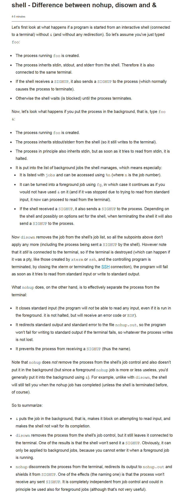
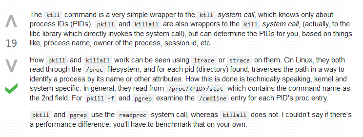

************
CPU
************

*Some useful links to cover the basics of CPU processing*

########
Concepts
########

- https://www.slashroot.in/difference-between-process-and-thread-linux

- http://blog.scoutapp.com/articles/2009/07/31/understanding-load-averages

.. image:: ../source/images/cpu-process-contents.png
    :width: 1650px
    :align: center
    :height: 1275px

Types of Processes
********************************************
- http://www.gmarik.info/blog/2012/orphan-vs-zombie-vs-daemon-processes/

Output of ps command - Explained
**************************************
- http://superuser.com/questions/117913/ps-aux-output-meaning

.. image::  ../source/images/cpu-ps-aux-meaning.png
    :width: 695px
    :align: center
    :height: 440px

- http://thelinuxstuff.blogspot.in/2012/08/process-state-codes-in-ps-output.html

.. image::  ../source/images/cpu-process-state-codes.png
    :width: 733px
    :align: center
    :height: 654px

##########
Commands
##########

NoHUP &
*************************
- https://stackoverflow.com/questions/15595374/whats-the-difference-between-nohup-and-ampersand

- https://unix.stackexchange.com/questions/3886/difference-between-nohup-disown-and

top
*****

- http://www.thegeekstuff.com/2010/01/15-practical-unix-linux-top-command-examples/
   
- http://www.slashroot.in/linux-cpu-performance-monitoring-tutorial
   
- http://www.tecmint.com/command-line-tools-to-monitor-linux-performance/
   
- http://tecadmin.net/understanding-linux-top-command-results-uses/
   
- http://linuxaria.com/howto/understanding-the-top-command-on-linux
   
- http://www.tecmint.com/12-top-command-examples-in-linux/
   
- http://linoxide.com/linux-command/linux-top-command-examples-screenshots/   
  
- http://www.dowdandassociates.com/blog/content/howto-troubleshoot-with-linux-top-command/
   
- http://www.linuxjournal.com/magazine/hack-and-linux-troubleshooting-part-i-high-load
     
- http://www.crucialp.com/resources/tutorials/server-administration/server-loads-explained-linux-unix/
   
- https://haydenjames.io/use-atop-linux-server-performance-analysis/
   
- https://alvinalexander.com/linux/unix-linux-process-memory-sort-ps-command-cpu
   
- https://math-linux.com/linux/tip-of-the-day/article/find-out-biggest-cpu-memory-consuming-processes-with-ps-command

SAR
*****

- http://www.thegeekstuff.com/2011/03/sar-examples/
   
- http://linoxide.com/linux-command/linux-system-performance-monitoring-using-sar-command/
   
- http://www.slashroot.in/examples-using-sar-command-system-monitoring-linux
   
- http://www.blackmoreops.com/2014/06/18/sysstat-sar-examples-usage/
   
- http://linoxide.com/linux-command/linux-pidstat-monitor-statistics-procesess/
   
- http://www.thegeekstuff.com/2014/11/pidstat-examples/
   
- http://www.yourownlinux.com/2014/08/sar-command-in-linux-tutorial-with-examples.html
      
- https://crybit.com/sar-command/
  
- http://www.cyberciti.biz/open-source/command-line-hacks/linux-monitor-process-using-pidstat/

Nice / Renice / IOnice
*************************

- https://www.faqforge.com/linux/reduce-load-of-backup-scripts-with-nice-and-ionice/ 
   
- http://www.slashroot.in/nice-and-renice-command-usage-examples-process-priority-linux

KILL
*******

- http://www.thegeekstuff.com/2012/03/linux-signals-fundamentals/

- https://www.quora.com/What-is-the-difference-between-Kill-and-Kill-9-command-in-Unix

- http://bencane.com/2014/04/01/understanding-the-kill-command-and-how-to-terminate-processes-in-linux/
   
- https://rtcamp.com/tutorials/linux/kill-all-processes/
   
- http://www.tecmint.com/how-to-kill-a-process-in-linux/
   
- https://www.digitalocean.com/community/tutorials/how-to-use-ps-kill-and-nice-to-manage-processes-in-linux
   
- http://www.cyberciti.biz/faq/unix-linux-killall-command-examples-usage-syntax/

- https://unix.stackexchange.com/questions/252349/what-is-the-difference-between-kill-pkill-and-killall

HTop
*******

Visual representation of all HTop parameters
********************************************************
- https://codeahoy.com/2017/01/20/hhtop-explained-visually/

.. image::  ../source/images/cpu-visual-htop.png
    :width: 2100px
    :align: center
    :height: 500px
        
HTop command - Explained
********************************************
- https://peteris.rocks/blog/htop/

- http://www.servercraftmen.com/performance-tuning-htop-usage/

- http://www.webhostingbuzz.com/wiki/install-htop-linux/
   
- https://www.tecmint.com/install-htop-linux-process-monitoring-for-rhel-centos-fedora/
   
- https://delightlylinux.wordpress.com/2014/03/24/htop-a-better-process-viewer-then-top/
   
- http://www.thegeekstuff.com/2011/09/linux-htop-examples

SysDig
**************
- https://sysdig.com/blog/sysdig-vs-dtrace-vs-strace-a-technical-discussion/

- https://www.sysdig.org/wiki/sysdig-user-guide/

- https://github.com/draios/sysdig/wiki/Sysdig-Examples

- https://sysdig.com/blog/linux-troubleshooting-cheatsheet/

- http://bencane.com/2014/04/18/using-sysdig-to-troubleshoot-like-a-boss/

- http://xmodulo.com/monitor-troubleshoot-linux-server-sysdig.html

################
Configuration
################

################################   
Troubleshooting & Log Parsing
################################

- **Find the most number of processes running on the system**

.. code-block:: bash
   :linenos: 
   
   sudo ps -AL --no-headers | awk -F: '{print $3}' | cut -d' ' -f2 | sort | uniq -c | sort -n | tail -10

- **Check for zombie processes with PPID**

.. code-block:: bash
   :linenos: 
   
   sudo ps axo stat,ppid,pid,comm | grep -w defunct
