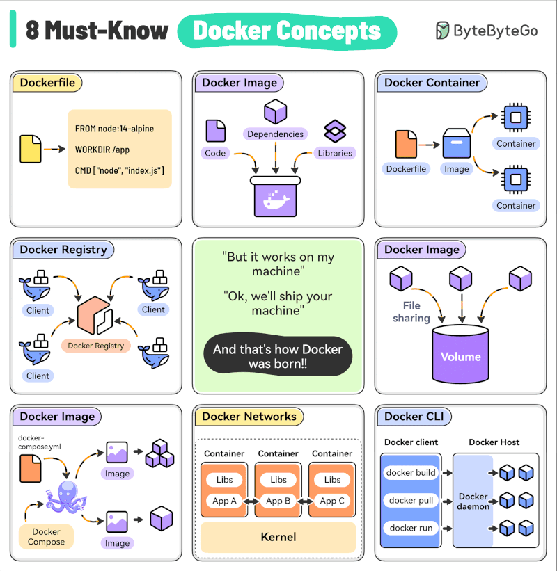
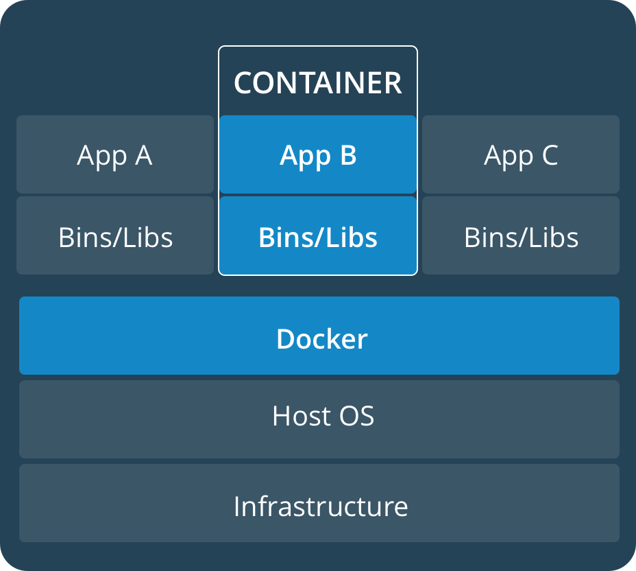
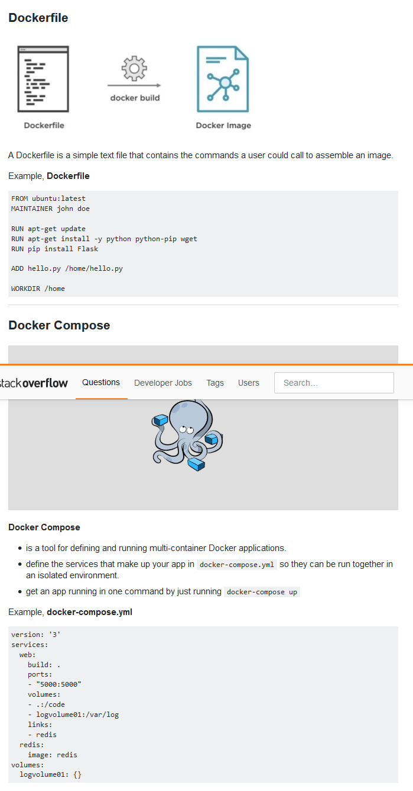

************
Docker
************

*Some useful links to explain the concepts of Docker*

##############################
Official Docker Documentation
##############################
- https://docs.docker.com/

########
Concepts
########
   
- https://medium.freecodecamp.org/a-beginner-friendly-introduction-to-containers-vms-and-docker-79a9e3e119b

- https://dev.to/softchris/5-part-docker-series-beginner-to-master-3m1b?

- https://hackernoon.com/beginners-guide-to-microservices-explaining-it-to-a-5-year-old-4481f5aba466

- https://jvns.ca/blog/2019/11/18/how-containers-work--overlayfs

- https://labs.iximiuz.com/tutorials/container-networking-from-scratch

- https://labs.iximiuz.com/tutorials/container-networking-from-scratch

Good Explanation of Namespaces : needed for Docker
*********************************************************************
- https://www.toptal.com/linux/separation-anxiety-isolating-your-system-with-linux-namespaces

Difference between containers and VMs
*********************************************************************
- https://stackoverflow.com/questions/16047306/how-is-docker-different-from-a-normal-virtual-machine

Docker Image Layers : Easy Explanation
**********************************************
- http://tuhrig.de/layering-of-docker-images/ 
   
Docker Swarm Working
**********************************************
- https://docs.docker.com/engine/swarm/how-swarm-mode-works/services/

#########################
Configuration
#########################
- https://docs.docker.com/config/containers/resource_constraints/

- https://stackoverflow.com/questions/29480099/docker-compose-vs-dockerfile-which-is-better

- https://www.digitalocean.com/community/tutorials/how-to-use-traefik-as-a-reverse-proxy-for-docker-containers-on-ubuntu-18-04

- https://blog.codeship.com/orchestrate-containers-for-development-with-docker-compose/

- https://iximiuz.com/en/posts/multiple-containers-same-port-reverse-proxy/

- https://vsupalov.com/docker-arg-env-variable-guide/

- https://pythonspeed.com/articles/docker-build-secrets

################################
Troubleshooting & Log Parsing
################################
- https://stackoverflow.com/questions/28320134/how-to-list-all-tags-for-a-docker-image-on-a-remote-registry

- https://stackoverflow.com/questions/24481564/how-can-i-find-a-docker-image-with-a-specific-tag-in-docker-registry-on-the-dock/32622147

- https://codefresh.io/blog/not-ignore-dockerignore-2/

################################
Tuning & Hardening
################################
- https://cloudvedas.com/how-to-cap-or-limit-memory-usage-of-a-docker-container/

- https://56k.cloud/blog/put-the-brakes-on-docker-containers/

- https://bluelight.co/blog/how-to-choose-a-container-registry

#########################
Training & Certification
#########################

Docker Training
************************
- http://training.play-with-docker.com/ops-landing/
   
- http://training.play-with-docker.com/alacart/
   
- https://katacoda.com/login

- http://container.training/

- https://github.com/veggiemonk/awesome-docker

- https://docker-curriculum.com/

Docker Certified Associate
*******************************************
- https://www.bretfisher.com/docker-certified-associate/

- https://www.linode.com/docs/applications/containers/when-and-why-to-use-docker/

- https://www.reddit.com/r/docker/comments/3yo0e8/is_there_any_advantage_to_using_docker_for/