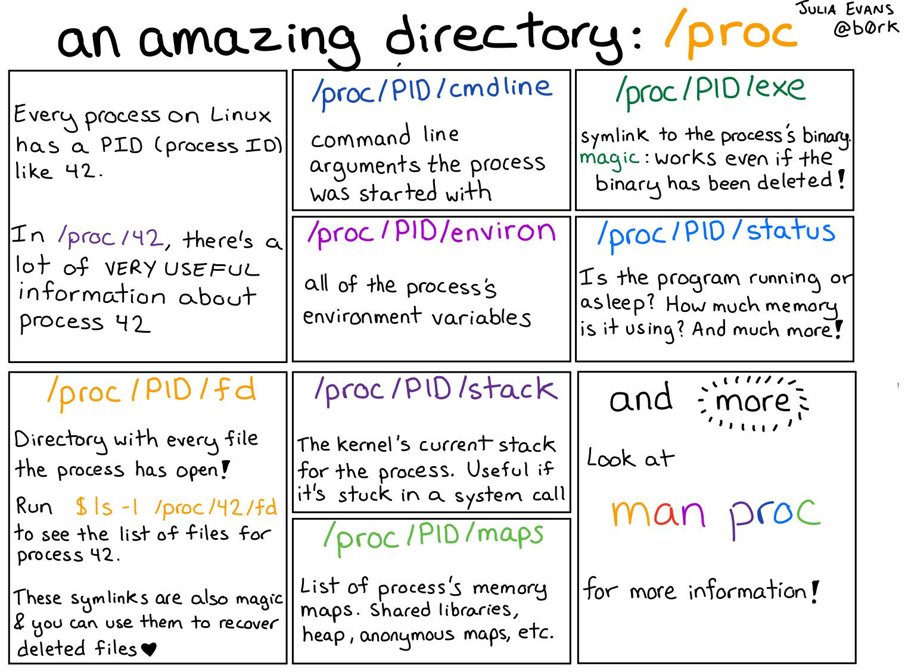

*******************
File Systems
*******************

*Some useful links to explain the concepts of File Systems*

########
Concepts
########

- https://www.nixtutor.com/linux/understanding-the-linux-directory-layout/
   
- https://www.slashroot.in/understanding-file-system-superblock-linux

- https://unix.stackexchange.com/questions/4402/what-is-a-superblock-inode-dentry-and-a-file

- https://www.cyberciti.biz/faq/understanding-unix-linux-bsd-device-files/

- https://askubuntu.com/questions/397493/what-does-the-first-character-of-unix-mode-string-indicate

- https://www.baeldung.com/linux/filesystem-guide

ext(2|3|4)
**************
- https://www.thegeekstuff.com/2011/05/ext2-ext3-ext4/
   
- https://adarsh5388.wordpress.com/2013/11/29/difference-between-ext2-ext3-and-ext4-filesystem-in-linux/
   
- https://kerneltalks.com/disk-management/difference-between-ext2-ext3-and-ext4/amp/
   
- https://linoxide.com/how-tos/explained-in-detail-linux-ext2-ext3-and-ext4-filesystem/amp/

File Descriptors
*******************
- https://linuxmeerkat.wordpress.com/2011/12/02/file-descriptors-explained/amp/

- https://www.bottomupcs.com/file_descriptors.xhtml

- https://www.cyberciti.biz/tips/linux-procfs-file-descriptors.html
   
Proc File Systems
*********************
- https://www.slashroot.in/proc-file-system-linux-explained

- https://www.thegeekstuff.com/2010/11/linux-proc-file-system/

ULimit   
**************
- https://easyengine.io/tutorials/linux/increase-open-files-limit/
 
- https://www.cyberciti.biz/faq/linux-increase-the-maximum-number-of-open-files/
  
- https://askubuntu.com/questions/181215/too-many-open-files-how-to-find-the-culprit
   

Directory Structures
**********************

.. image::  ../source/images/linux-filesystems.gif
    :width: 800px
    :align: center
    :height: 1040px
    :alt: Credits to ByteByteGo

- https://askubuntu.com/questions/34880/use-of-opt-and-usr-local-directories-in-the-context-of-a-pc
   
- https://www.ghacks.net/2009/04/04/get-to-know-linux-the-etcinitd-directory/
   
- https://askubuntu.com/questions/19320/how-to-enable-or-disable-services
   

Inodes
**************
- https://www.slashroot.in/inode-and-its-structure-linux
   
- https://tecadmin.net/what-is-inode-number-in-linux/
   
- https://www.grymoire.com/Unix/Inodes.html

- https://teaching.idallen.com/dat2330/04f/notes/links_and_inodes.html
   

##########
Commands
##########

S-Trace command
*********************
- https://blog.packagecloud.io/how-does-strace-work/
   
- https://hokstad.com/5-simple-ways-to-troubleshoot-using-strace
   
- https://www.cyberciti.biz/tips/linux-strace-command-examples.html
   
- https://blog.packagecloud.io/strace-cheat-sheet/
