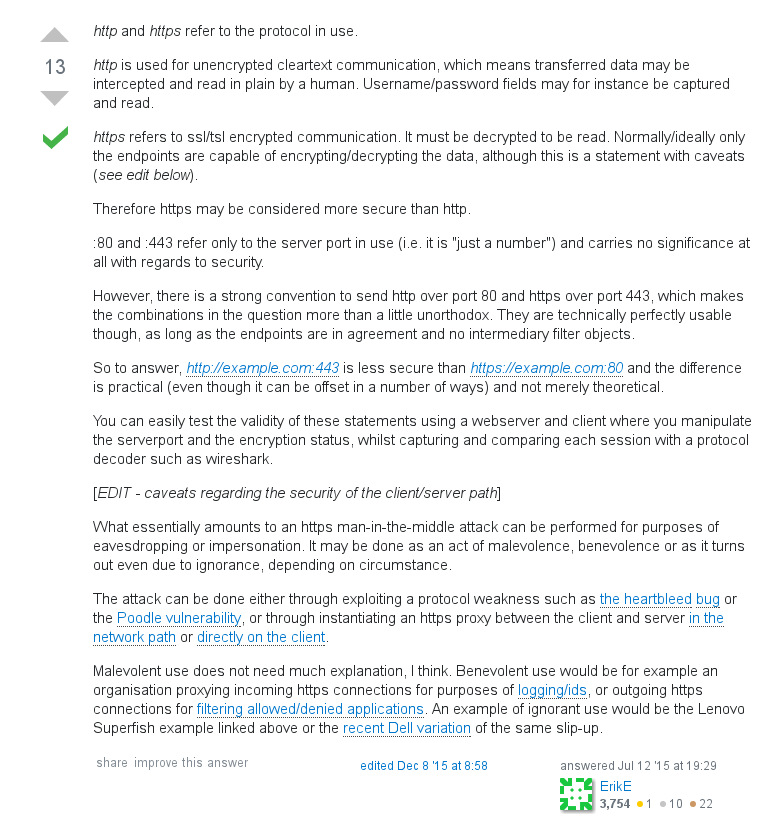
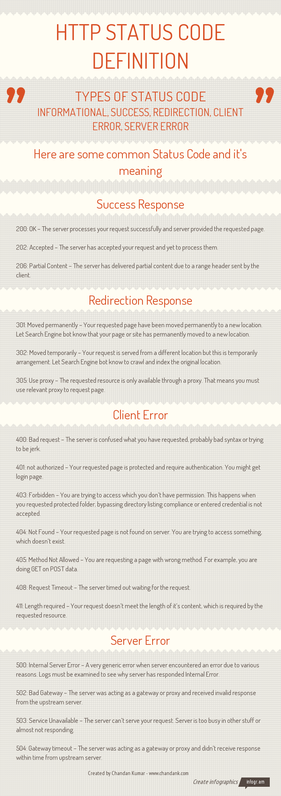

Fundamentals
*******************

*Some useful links to explain the concepts of Web-Servers*

##########
Concepts
##########

- http://computer.howstuffworks.com/web-server2.htm
 
- https://serversforhackers.com/hosting-web-applications
   
- https://danielmiessler.com/study/web-performance/
   
- https://launchschool.com/books/http/read/introduction
   
- https://github.com/alex/what-happens-when

- https://howhttps.works/
   
- https://dev.to/pratikaambani/explain-http-verbs-like-im-five-b10
   
- http://stackoverflow.com/questions/224664/difference-between-proxy-server-and-reverse-proxy-server
   
- https://dev.to/swyx/every-web-performance-test-tool-naj

Load Balancing
#####################
- https://blog.envoyproxy.io/introduction-to-modern-network-load-balancing-and-proxying-a57f6ff80236

- https://avinetworks.com/what-is-load-balancing

- https://levelup.gitconnected.com/l4-vs-l7-load-balancing-d2012e271f56

HTTP request lifecycle overview 
#################################
- https://dev.to/dangolant/things-i-brushed-up-on-this-week-the-http-request-lifecycle-
   

Difference between ``http 443 and https 80``
##############################################
- http://serverfault.com/questions/705197/http-over-port-443-vs-https-over-port-80

        
HTTP status codes
########################
- http://www.restapitutorial.com/httpstatuscodes.html
   
- https://httpstatuses.com/

- https://stackoverflow.com/questions/50143518/401-unauthorized-vs-403-forbidden-which-is-the-right-status-code-for-when-the-u

- https://stackoverflow.com/questions/3297048/403-forbidden-vs-401-unauthorized-http-responses
  
- https://geekflare.com/http-status-code-infographics/

Check website-availability issues - Tools
############################################
- https://www.site24x7.com/tools.html
   
- https://geopeeker.com/
   
- https://httpstatus.io/
        
        
#######   
cURL
#######
- http://www.thegeekstuff.com/2012/04/curl-examples/
   
- http://www.slashroot.in/curl-command-tutorial-linux-example-usage
   
- https://curl.haxx.se/docs/httpscripting.html
   
- https://ec.haxx.se/curl.html
   
- http://www.codediesel.com/tools/6-essential-curl-commands/
   
- https://robots.thoughtbot.com/back-to-basics-http-requests
   
- https://blog.josephscott.org/2011/10/14/timing-details-with-curl/

- https://stackoverflow.com/questions/46362284/run-multiple-curl-commands-in-parallel

- http://http-prompt.com/

#######
wGET
#######
- http://www.thegeekstuff.com/2009/09/the-ultimate-wget-download-guide-with-15-awesome-examples/
   
- http://www.tecmint.com/10-wget-command-examples-in-linux/
   
- http://www.labnol.org/software/wget-command-examples/28750/
   
- http://www.linuxtechi.com/wget-command-practical-examples/
   
- https://alvinalexander.com/linux-unix/how-to-make-offline-mirror-copy-website-with-wget

