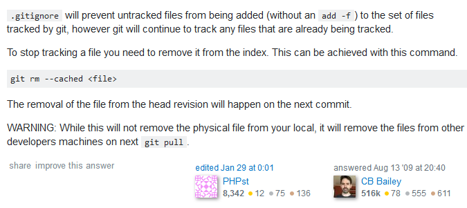

************
GIT
************

*Some useful links to cover the basics of GIT*

########
Concepts
########

Official Git Documentation
#################################
- https://git-scm.com/book/en/v2/

- https://danielmiessler.com/study/git/
   
- https://about.gitlab.com/2015/05/18/simple-words-for-a-gitlab-newbie/

- http://slidetocode.com/2013/08/25/how-git-works/
   
- http://juristr.com/blog/2013/04/git-explained/
   
- https://betterexplained.com/articles/aha-moments-when-learning-git/
   
- http://readwrite.com/2013/09/30/understanding-github-a-journey-for-beginners-part-1/
   
- http://2ndscale.com/rtomayko/2008/the-thing-about-git
   
- http://eagain.net/articles/git-for-computer-scientists/
   
- https://www.sbf5.com/~cduan/technical/git/git-1.shtml
   
- https://launchschool.com/books/git/read/introduction
   
- http://githowto.com/
   
- http://gitimmersion.com/lab_01.html
   
- http://swift.siphos.be/aglara/centralcmdb.html
   
- http://www.gitguys.com/topics/
   
- https://robots.thoughtbot.com/tags/git
   
- https://www.linux.com/learn/finding-everything-git
   
- http://slidetocode.com/2013/08/25/how-git-works/

- http://juristr.com/blog/2013/04/git-explained/
   
- http://pcottle.github.io/learnGitBranching/
   
- http://rogerdudler.github.io/git-guide/
   
- https://dev.to/raha198/how-to-master-the-art-of-git
   
- http://www.sitepoint.com/git-for-beginners/
   
- https://dev.to/maxwell_dev/the-git-rebase-introduction-i-wish-id-had

################
Configuration
################
- https://www.atlassian.com/git/tutorials/
   
- http://eev.ee/blog/2015/04/24/just-enough-git-to-be-less-dangerous/
   
- http://kushagragour.in/blog/2014/01/build-git-learn-git/
   
- http://wildlyinaccurate.com/a-hackers-guide-to-git/
   
- https://www.digitalocean.com/community/tutorials/how-to-use-git-effectively

- https://www.digitalocean.com/community/tutorials/how-to-use-git-branches
   
- http://redmine.jamoma.org/projects/1/wiki/Working_with_GIT_branches
     
- https://try.github.io/levels/1/challenges/1
   
- https://help.github.com/articles/which-remote-url-should-i-use/
   
- https://help.github.com/articles/using-ssh-over-the-https-port/
   
- https://medium.com/@haydar_ai/learning-how-to-git-using-ssh-instead-of-https-91f09cff72de

- https://rtcamp.com/tutorials/git/ 
   
- https://git-scm.com/book/en/v2/Git-Basics-Viewing-the-Commit-History
   
- Update multiple git repos : https://github.com/earwig/git-repo-updater
   

####################################
Self-hosted GitHub Clones
####################################

- https://gogs.io/
      
- https://gitea.io/en-US/
   
- https://gitlab.com/

Reviews || Configuration of the above
#######################################
- https://blog.ifloop.org/2017/10/12/gitlab-vs-gogs-vs-gitea/
   
- https://www.reddit.com/r/git/comments/6y68vr/gitlab_vs_bitbucket_server_vs_gitea_vs_gogs/
   
- https://github.com/MartinThoma/MartinThoma.github.io/blob/pelican/content/2017-09-06-git-repository-managers.md
   
- https://gitbucket.github.io/gitbucket-news/gitbucket/2017/03/29/benchmark-of-gitbucket.html

- https://blog.hypriot.com/post/run-your-own-github-like-service-with-docker/ 
   

#####################
Troubleshooting
#####################

- http://www.gitguys.com/topics/merging-with-a-conflict-conflicts-and-resolutions/

- https://help.github.com/articles/error-permission-denied-publickey/
   
- http://www.ikriv.com/blog/?p=1905

Remove local commits NOT pushed to remote
#########################################
- http://stackoverflow.com/questions/927358/how-to-undo-last-commits-in-git
   
- http://stackoverflow.com/questions/1611215/remove-a-git-commit-which-has-not-pushed

Understanding .gitignore file
#########################################
- https://www.git-tower.com/learn/git/faq/ignore-tracked-files-in-git

- https://github.com/github/gitignore

- https://www.gitignore.io/

- https://stackoverflow.com/questions/1274057/how-to-make-git-forget-about-a-file-that-was-tracked-but-is-now-in-gitignore

Git Operations (Stash, Merge, Diff)
##############################################
- https://www.atlassian.com/git/tutorials/saving-changes/git-stash

- https://www.git-tower.com/learn/git/faq/save-changes-with-git-stash

- https://stackoverflow.com/questions/19003009/how-to-recover-stashed-uncommitted-changes

- https://www.atlassian.com/git/tutorials/using-branches/git-merge

- https://stackoverflow.com/questions/4099742/how-to-compare-files-from-two-different-branches

.. image::  ../source/images/git-compare-files-diff-branches.png
    :width: 688px
    :align: center
    :height: 609px

####################
Better GIT Workflow
####################

- https://pixelbrackets.github.io/git_cheat_sheet/

- https://github.com/git-tips/tips

- https://github.com/so-fancy/diff-so-fancy

- https://dev.to/shreyasminocha/how-i-do-my-git-commits-34d?

- https://gist.github.com/PurpleBooth/109311bb0361f32d87a2

- http://michaelwales.com/articles/make-gitconfig-work-for-you/

- https://blog.scottnonnenberg.com/better-git-configuration/

- https://howtogit.net/

- https://githooks.com/

- https://nvie.com/posts/a-successful-git-branching-model/

- https://dev.to/_darrenburns/8-productivity-tips-for-github-44kn

- https://scotch.io/tutorials/using-git-hooks-in-your-development-workflow

################
Random Notes
################
- https://svnvsgit.com

