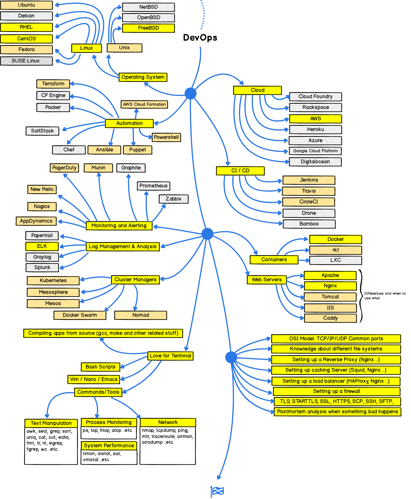

************
Generic
************

*Some useful links to cover the basics of Programming*

########
Concepts
########

- https://akbarahmed.com/2012/06/24/uninstall-java-from-ubuntu-linux/

- http://regex.learncodethehardway.org/book/
   
- https://techdifferences.com/differenece-between-for-and-while-loop.html#KeyDifferences
   
- http://syndicode.co/2018/01/29/books-and-tutorials-for-learning-and-mastering-ruby-language/
   
- https://dev.to/sandordargo/8-books-every-junior-developer-should-read--4p5h

- https://dev.to/perigk/fantastic-youtube-channels-with-top-quality-learning-for-software-engineers--263i

- https://dev.to/tapudp/github-repos-for-learners-634

- https://dev.to/codehakase/how-i-learned-go-programming
   
- https://dev.to/brpaz/my-linux-development-environment-of-2018-ch7
   
- https://dev.to/rpalo/powershell-tutorial-especially-for-people-who-hate-powershell-2g25

- https://devdocs.io

- https://books.goalkicker.com/

################
Configuration
################

Online Interpreter for Multiple Languages
#############################################
- https://tio.run/

#################
DevOps
#################

- https://devops.zeef.com/christian.peper

- https://dev-ops-tools.zeef.com/richard.kraayenhagen

- https://dev.to/

- https://xebialabs.com/glossary/

- https://xebialabs.com/the-ultimate-devops-tool-chest/

- https://xebialabs.com/periodic-table-of-devops-tools/

- https://zachholman.com/posts/deploying-software

- https://www.ibm.com/developerworks/learn/devops/

- https://learn-anything.xyz/programming/software-development/devops

- http://itrevolution.com/devops-blog/

- https://continuousdelivery.com

- http://dev2ops.org

- https://codeascraft.com

- http://www.devopsbookmarks.com

- https://www.amazon.com/Phoenix-Project-DevOps-Helping-Business/dp/0988262592

- https://increment.com/on-call/

- https://medium.com/cleartax-engineering/cleartaxs-requirements-from-a-deployment-pipeline-1b77a55ba08c

- http://www.humanops.com/
