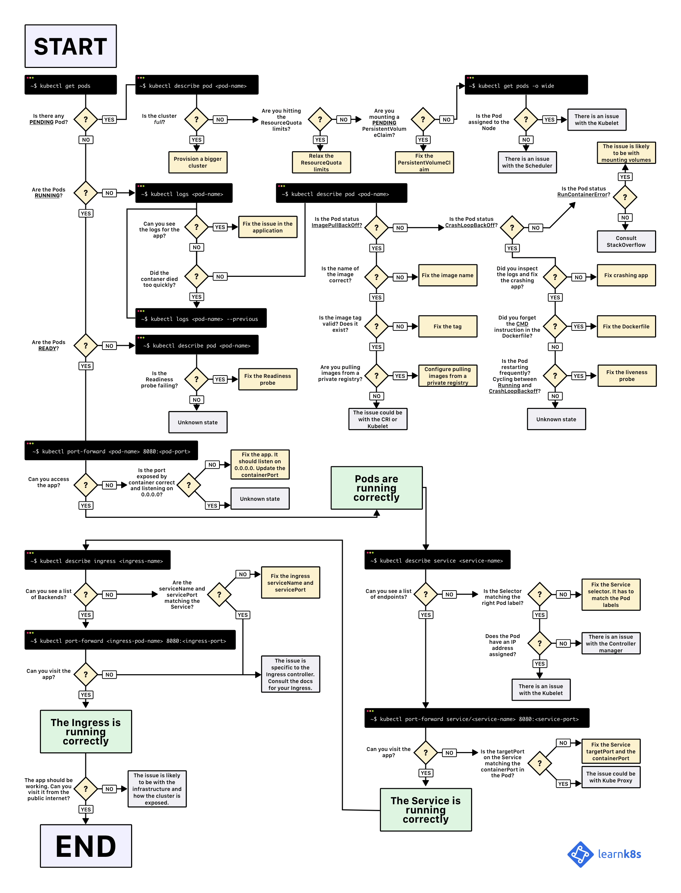

***************
Kubernetes
***************

*Some useful links to explain the concepts of Kubenetes*

#########
Concepts
#########

#########################
Official Documentation
#########################
- https://kubernetes.io/docs/home

##################
Configuration
##################
- https://medium.com/@jmarhee/managing-kubernetes-config-contexts-fbe710fa756a

- https://nikgrozev.com/2019/10/03/switch-between-multiple-kubernetes-clusters-with-ease/

- https://sysdig.com/blog/kubernetes-limits-requests/

##################
Tuning & Hardening
##################
- https://github.com/derailed/popeye

##################
Troubleshooting
##################
- https://stackoverflow.com/questions/57161481/kubectl-how-to-display-pod-logs-without-specyfing-the-pod-name-explicitly/57161894#57161894

- https://stackoverflow.com/questions/54821044/how-to-stop-pause-a-pod-in-kubernetes/54822866#54822866

- https://stackoverflow.com/questions/35453792/pods-stuck-in-terminating-status/38178833#38178833

.. image::  ../source/images/k8s-pod-stuck-in-terminating-status.png
    :width: 717px
    :align: center
    :height: 171px

- https://learnk8s.io/troubleshooting-deployments

