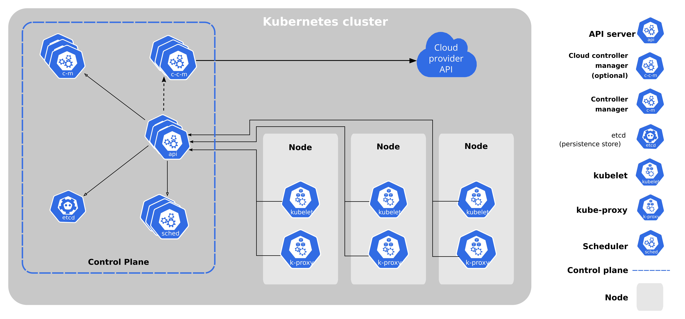

***************
Kubernetes
***************

*Some useful links to explain the concepts of Kubernetes*

#########
Concepts
#########
- https://dev.to/techworld_with_nana/kubernetes-simply-explained-for-beginners-33em

- https://dev.to/aurelievache/kubernetes-sketchnotes-pods-4ib0

- https://speakerdeck.com/thockin/the-ins-and-outs-of-networking-in-google-container-engine

- https://jvns.ca/blog/2017/06/04/learning-about-kubernetes

- https://www.jeremyjordan.me/kubernetes

- https://ubuntu.com/kubernetes/what-is-kubernetes

- https://iximiuz.com/en/posts/kubernetes-api-structure-and-terminology/

- https://jvns.ca/blog/2017/06/04/learning-about-kubernetes/

#########################
Official Documentation
#########################
- https://kubernetes.io/docs/home

- https://kubectl.docs.kubernetes.io

- https://kubernetes.io/docs/reference/glossary/?all=true

####################################
Kubernetes Components Explained
####################################

ETCd
******
- https://learnk8s.io/etcd-kubernetes

- https://rafay.co/the-kubernetes-current/etcd-kubernetes-what-you-should-know/

ReplicaSet
****************
- https://www.learnsteps.com/basics-on-kubernetes-what-exactly-is-a-replicaset/

##################
Configuration
##################
- https://medium.com/@jmarhee/managing-kubernetes-config-contexts-fbe710fa756a

- https://nikgrozev.com/2019/10/03/switch-between-multiple-kubernetes-clusters-with-ease/

- https://sysdig.com/blog/kubernetes-limits-requests/

- https://speakerdeck.com/thockin/bringing-traffic-into-your-kubernetes-cluster

- https://devopscube.com/kubernetes-tutorials-beginners/

- https://www.asykim.com/blog/deep-dive-into-kubernetes-external-traffic-policies

- https://collabnix.github.io/kubelabs/

##################
Tuning & Hardening
##################

- https://learnk8s.io/how-many-clusters

- https://learnk8s.io/production-best-practices

- https://learnk8s.io/kubernetes-instance-calculator

- https://github.com/derailed/popeye

##################
Troubleshooting
##################
- https://stackoverflow.com/questions/57161481/kubectl-how-to-display-pod-logs-without-specyfing-the-pod-name-explicitly/57161894#57161894

- https://stackoverflow.com/questions/54821044/how-to-stop-pause-a-pod-in-kubernetes/54822866#54822866

- https://stackoverflow.com/questions/35453792/pods-stuck-in-terminating-status/38178833#38178833

.. image::  ../source/images/k8s-pod-stuck-in-terminating-status.png
    :width: 717px
    :align: center
    :height: 171px

- https://learnk8s.io/troubleshooting-deployments

.. image::  ../source/images/k8s-debug-flowchart.png
    :width: 1995px
    :align: center
    :height: 2616px
