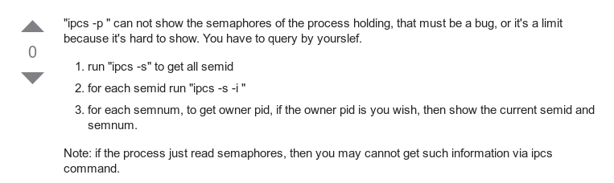

************
Memory
************

*Some useful links to explain the concepts of Memory*

########
Concepts
########

- https://ioflood.com/blog/making-sense-of-linux-memory-usage-part-1-how-to-read-top-in-centos/
 
- https://www.reddit.com/r/linux/comments/1hk5ow/free_buffer_swap_dirty_procmeminfo_explained/

- https://samwho.dev/memory-allocation/

##########
Commands
##########

Free Command - Explained
********************************************

- https://www.linuxatemyram.com/

- https://cloudibee.com/2008/02/14/know-about-procmeminfo/

Other Commands
*********************
   
- https://www.thegeekstuff.com/2010/08/ipcs-command-examples/

   
- https://www.tecmint.com/dool-monitor-linux-server-performance-process-memory-network/

################
Configuration
################

- https://github.com/pixelb/ps_mem/

Create a RAM Disk
********************************************
- https://www.jamescoyle.net/how-to/943-create-a-ram-disk-in-linux
  

################################
Troubleshooting & Log Parsing
################################
