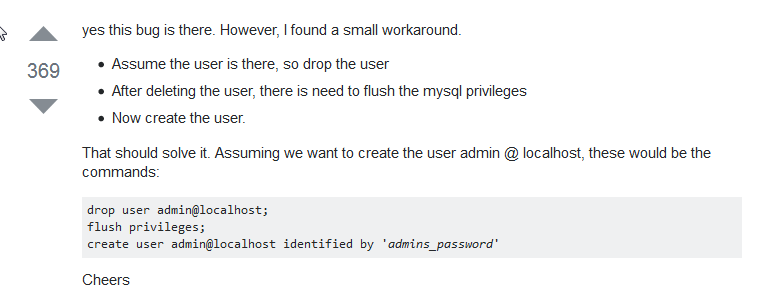

**********
MySQL
**********

*Some useful links to explain the concepts of MySQl*

##############################
Official MySQL Documentation
##############################
- https://dev.mysql.com/doc/refman/8.0/en/

########
Concepts
########
- https://technically.dev/posts/sql-for-the-rest-of-us

- https://etutorials.org/SQL/MySQL/

- https://www.rathishkumar.in/2016/04/understanding-mysql-architecture.html?

- https://dbdb.io/

Difference between MyISAM and InnoDB Storage engines
******************************************************************
- https://www.rapidprogramming.com/questions-answers/differences-between-innodb-and-myisam-in-mysql-innodb-vs-myisam-1533
 

##########
Commands
##########
- https://www.mysqltutorial.org/

- https://stackoverflow.com/questions/924729/how-to-best-display-in-terminal-a-mysql-select-returning-too-many-fields

.. code-block:: sql
   :linenos:

   mysql> pager less -SFX
   mysql> SELECT * FROM sometable;

- https://stackoverflow.com/questions/1733507/how-to-get-size-of-mysql-database

.. code-block:: sql
   :linenos: 
   
     SELECT table_schema "DB Name", ROUND(SUM(data_length + index_length) / 1024 / 1024, 1) "DB Size in MB" FROM information_schema.tables GROUP BY table_schema;

- https://dba.stackexchange.com/questions/36776/how-can-i-verify-im-using-ssl-to-connect-to-mysql

- https://popsql.com/learn-sql/mysql/how-to-create-an-index-in-mysql
 
 
################
Configuration
################
- https://www.percona.com/blog/2014/11/12/log-rotate-and-the-deleted-mysql-log-file-mystery/
   
- https://blog.oneiroi.co.uk/mysql/mysql-slow-query-log-rotation/
   
- https://etutorials.org/SQL/MySQL/Part+III+MySQL+Administration/Chapter+11.+General+MySQL+Administration/Maintaining+Log+Files/
   

Backing Up | Restore Databases via Command Line
******************************************************************
- https://www.mysqltutorial.org/how-to-backup-database-using-mysqldump.aspx
   
- https://www.tecmint.com/mysql-backup-and-restore-commands-for-database-administration/

Configure MariaDB for remote access
*********************************************
- https://mariadb.com/kb/en/library/configuring-mariadb-for-remote-client-access/

Remove a MySQL user with privileges 
***********************************************
- https://nsaunders.wordpress.com/2007/04/30/removing-a-mysql-user/
   
- https://www.a2hosting.in/kb/developer-corner/mysql/managing-mysql-databases-and-users-from-the-command-line

Information on MySQL Bin logs
************************************
- https://www.cyberciti.biz/faq/what-is-mysql-binary-log/

Replication (Master-Master)
********************************
- https://www.digitalocean.com/community/tutorials/how-to-set-up-mysql-master-master-replication

Replication (Master-Slave)
********************************
- https://www.tecmint.com/how-to-setup-mysql-master-slave-replication-in-rhel-centos-fedora/
   
- https://www.digitalocean.com/community/tutorials/how-to-set-up-master-slave-replication-in-mysql
   
- https://aarvik.dk/how-to-set-up-master-slave-replication-in-mysql/

Reset forgotten MySQL password
************************************
- https://www.digitalocean.com/community/tutorials/how-to-reset-your-mysql-or-mariadb-root-password
   
- https://www.cyberciti.biz/faq/mysql-change-root-password/
   
- https://www.liquidweb.com/kb/change-a-password-for-mysql-on-linux-via-command-line/

################################
Troubleshooting & Log Parsing
################################

- https://www.percona.com/blog/2013/04/18/rotating-mysql-slow-logs-safely/

- https://alvinalexander.com/blog/post/mysql/how-show-open-database-connections-mysql

- https://www.tecmint.com/mysqladmin-commands-for-database-administration-in-linux/
   
- https://major.io/2008/06/24/mysql-error-1040-too-many-connections/
   
- https://www.digitalocean.com/community/tutorials/how-to-use-mytop-to-monitor-mysql-performance

Check for replication Lags
************************************
- https://www.percona.com/blog/2007/10/12/managing-slave-lag-with-mysql-replication/   

- https://www.percona.com/blog/2014/05/02/how-to-identify-and-cure-mysql-replication-slave-lag/

Enable various logs via my.cnf or without restart
******************************************************************
- https://www.pontikis.net/blog/how-and-when-to-enable-mysql-logs

Change the value of expire_log_days without MySQL restart
******************************************************************
- https://www.sebastien-han.fr/blog/2013/02/15/purge-mysql-binary-logs/

##################
Tuning & Hardening
##################
- https://www.digitalocean.com/community/tutorials/how-to-secure-mysql-and-mariadb-databases-in-a-linux-vps
  
- https://serversforhackers.com/c/mysql-network-security
   
- https://hakibenita.com/sql-tricks-application-dba

- https://severalnines.com/resources/database-management-tutorials/mysql-load-balancing-haproxy-tutorial

Perl script to analyze system MySQL variables & optimize
*************************************************************************
- https://major.io/mysqltuner/

MySQL error codes
**************************
- http://www.fromdual.com/mysql-error-codes-and-messages
   
- https://major.io/2007/08/09/mysql-error-codes/

Fix for the ERROR 1396
***************************
- https://stackoverflow.com/questions/5555328/error-1396-hy000-operation-create-user-failed-for-jacklocalhost

