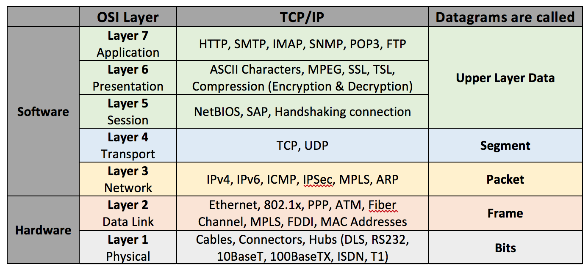
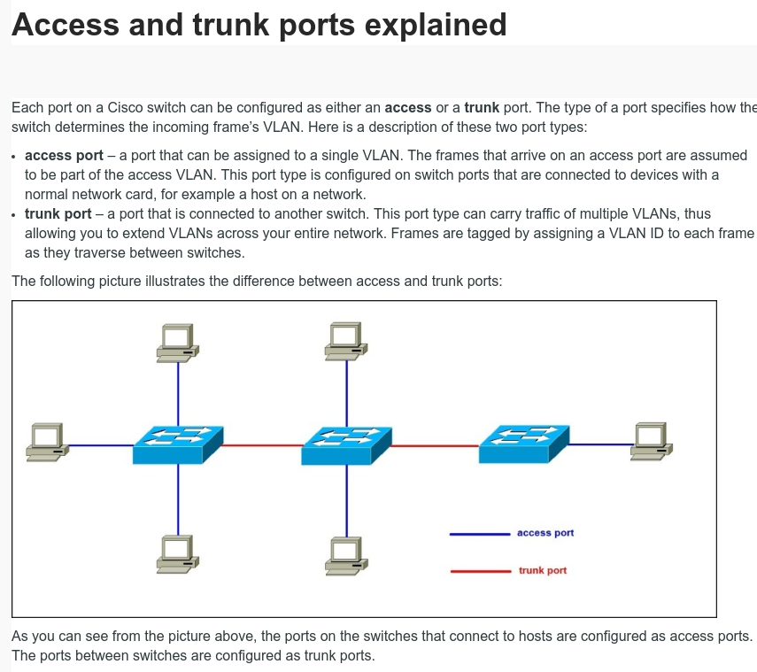

*****************
Networking
*****************

*Some useful links to cover the basics of Networking Protocols*

########
Concepts
########

OSI Model Mnemonic : ``Please Do Not Teach Students Pointless Acronyms``
########################################################################
- https://www.cybrary.it/0p3n/osi-model-7-layers-basic-understanding/

- https://www.thomas-krenn.com/en/wiki/Two_Default_Gateways_on_One_System

- http://cavepopo.hd.free.fr/wordpress/linux/networking-on-linux-practical-examples/

- http://www.linuxhomenetworking.com/

Finding optimum MTU ``(Maximum Transmission Unit)`` size
#########################################################
- http://homenetworkadmin.com/what-is-mtu-size/

- https://www.tp-link.com/us/FAQ-190.html
   
- https://www.linksys.com/us/support-article?articleNum=134914

Category Cables
####################
- https://www.networkcablingdirectory.com/articles/structured-network-cabling-id_1151.htm
   
- http://35.154.102.183/ethernet-cable-cat5-vs-cat6-vs-cat6a-vs-cat7-vs-cat8/amp/
   
- https://planetechusa.com/blog/ethernet-different-ethernet-categories-cat3-vs-cat5e-vs-cat6-vs-cat6a-vs-cat7-vs-cat8/

MAC Addresses : Explained
#########################

.. image::  ../source/images/networking-mac-address.png
    :width: 686px
    :align: center
    :height: 287px

Private  / Public / LocalHost IPs: 
#########################################

- http://www.tech-faq.com/127-0-0-1.html
   
- https://www.howtogeek.com/225487/what-is-the-difference-between-127.0.0.1-and-0.0.0.0/
   
- http://theydiffer.com/difference-between-public-and-private-ip-address/

- https://www.iplocation.net/public-vs-private-ip-address

.. image::  ../source/images/networking-private-ip-ranges.png
    :width: 726px
    :align: center
    :height: 290px

- http://serverfault.com/questions/49765/how-does-ipv4-subnetting-work/49836

- https://danielmiessler.com/study/subnetting/
 
- http://computer.howstuffworks.com/internet/basics/question549.htm
         
- http://unixadminschool.com/blog/2014/01/ipv6-the-solution-for-ipv4-exhaustion/

TCP
###########

States of a TCP Connection
********************************************
- https://community.apigee.com/articles/7970/tcp-states-explained.html
   
- https://blog.confirm.ch/tcp-connection-states/
   
- https://www.frozentux.net/iptables-tutorial/chunkyhtml/x1425.html
   
- http://www.masterraghu.com/subjects/np/introduction/unix_network_programming_v1.3/ch02lev1sec6.html
   
- https://www.ibm.com/support/knowledgecenter/en/SSLTBW_2.1.0/com.ibm.zos.v2r1.halu101/constatus.htm

- https://danielmiessler.com/study/tcpflags/

LIST of TCP / UDP Ports
********************************************
- https://en.wikipedia.org/wiki/List_of_TCP_and_UDP_port_numbers

UDP
###########

ICMP
###########
- https://danielmiessler.com/study/icmp/
   
- https://protechgurus.com/ip-routing-process-step-step-explanation/

- https://www.techrepublic.com/article/ip-routing-in-40-short-steps/

VLAN
###########

Simple Overview
********************
- https://www.lifewire.com/virtual-local-area-network-817357

Conceptual Overview
********************************************
- http://www.cisco.com/c/en/us/td/docs/switches/lan/catalyst4500/12-2/25ew/configuration/guide/conf/vlans.html

Difference between access & trunk ports
********************************************
- https://bit.ly/2rXuh6M

        
##########
Commands
##########

- http://www.alexonlinux.com/useful-linux-networking-commands
   
- https://www.lifewire.com/find-a-mac-address-using-an-ip-address-818132
   
- http://www.thegeekstuff.com/2012/04/ip-routing-intro/
   
- http://www.thegeekstuff.com/2012/04/route-examples
   
- http://computernetworkingnotes.com/linux/rhce6-study-guide/

PING
##########
- https://www.computerhope.com/unix/uping.htm
   
- http://www.slashroot.in/what-ping-sweep-and-how-do-ping-sweep

IFCONFIG
##########
- http://www.tecmint.com/ifconfig-command-examples/

- https://www.linux.com/learn/replacing-ifconfig-ip

- http://cavepopo.hd.free.fr/wordpress/linux/bash-command-tips-ethtool/ 
   
- http://www.cyberciti.biz/faq/check-network-connection-linux/

TRACEROUTE
####################
- http://www.slashroot.in/how-does-traceroute-work-and-examples-using-traceroute-command

- http://www.mavetju.org/networking/basicnetworktroubleshooting.php

TCPDUMP
##########
- https://danielmiessler.com/study/tcpdump/
   
- http://www.slashroot.in/packet-capturing-tcpdump-command-linux
   
- http://www.tecmint.com/12-tcpdump-commands-a-network-sniffer-tool/
   
- http://www.rationallyparanoid.com/articles/tcpdump.html

NETSTAT
##########
- https://www.linux.com/learn/intro-to-linux/2017/7/introduction-ss-command 
 
- http://www.slashroot.in/netstat-command-examples-and-its-usage
   
- http://www.binarytides.com/linux-ss-command/
   

IFTOP
#########
- http://www.slashroot.in/linux-iptraf-and-iftop-monitor-and-analyse-network-traffic-and-bandwidth
   
- http://www.thegeekstuff.com/2008/12/iftop-guide-display-network-interface-bandwidth-usage-on-linux/

- http://linoxide.com/monitoring-2/iftop-network-traffic/
   

NMap
#########
- https://danielmiessler.com/study/nmap/
   
- http://www.plugged.in/network/nmap-scanning-methods.html
   
- http://www.plugged.in/network/nmap-target-specification-in-detail.html

- http://www.cyberciti.biz/networking/nmap-command-examples-tutorials/

**Nmap Command - Free IPs in a particular subnet**

.. code-block:: bash
   :linenos: 

   for i in `sudo nmap -sP <subnet/CIDR> | grep -i 'Nmap scan report for' | awk '{print $5}'`;do ping -c 1 $i;done | grep from

ARP
######
- http://www.thegeekstuff.com/2012/01/arp-cache-poisoning/

- http://www.cyberciti.biz/faq/linux-duplicate-address-detection-with-arping/
   
- https://www.linux.com/news/ping-icmp-vs-arp
   
- http://xmodulo.com/how-to-add-or-remove-static-arp-entry-on-linux.html
   
- https://www.tummy.com/articles/networking-basics-how-arp-works/
   
- http://www.cyberciti.biz/faq/linux-duplicate-address-detection-with-arping/

NETCAT
#########
- http://aarvik.dk/netcat-basics-and-a-few-smart-examples/

LLDP
#########
- http://www.marcoach.nl/lldp-network-discovery/

################
Configuration
################

Basic NIC configuration & Bonding
###################################
- http://xmodulo.com/how-to-find-ethernet-network-interface-card-information-in-linux.html
   
- http://www.tecmint.com/configure-network-interface-in-rhel-centos-7-0/
   
- https://linuxconfig.org/how-to-add-new-static-route-on-rhel7-linux

- http://www.cyberciti.biz/tips/linux-bond-or-team-multiple-network-interfaces-nic-into-single-interface.html
  
- http://login2linux.blogspot.in/2015/01/how-to-remove-nic-bonding-in-linux.html

- http://www.configserverfirewall.com/ubuntu-linux/ubuntu-set-static-ip-address/
   
- https://www.swiftstack.com/docs/install/configure_networking.html
   
- http://www.itzgeek.com/how-tos/mini-howtos/change-default-network-name-ens33-to-old-eth0-on-ubuntu-16-04.html

Virtual IPs
###########
- http://www.cyberciti.biz/faq/linux-creating-or-adding-new-network-alias-to-a-network-card-nic/

- https://linuxconfig.org/configuring-virtual-network-interfaces-in-linux
   
- http://www.cyberciti.biz/faq/linux-command-to-remove-virtual-interfaces-or-network-aliases/
   
- http://www.jamescoyle.net/how-to/307-create-a-virtual-ip-address-in-linux 
   
- http://www.tecmint.com/create-multiple-ip-addresses-to-one-single-network-interface/

Static Routing
###############
- http://www.thegeekstuff.com/2012/04/route-examples/
   
- http://bencane.com/2013/05/12/adding-and-troubleshooting-static-routes-on-red-hat-based-linux-distributions/

- http://www.cyberciti.biz/faq/linux-route-add/
   
- http://www.thetechnicalstuff.com/how-to-add-and-delete-route-in-linux/

DHCP
###############
- http://tecadmin.net/configuring-dhcp-server-on-centos-redhat/

- http://linuxconfig.org/what-is-dhcp-and-how-to-configure-dhcp-server-in-linux
   
- http://www.hecticgeek.com/2012/01/command-line-ip-subnet-calculator-ubuntu-linux/

- https://www.geeksforgeeks.org/how-dhcp-server-dynamically-assigns-ip-address-to-a-host/

########################################
Tuning, Troubleshooting & Log Parsing
########################################

Advanced Configuration
################################
- http://www.slashroot.in/linux-kernel-rpfilter-settings-reverse-path-filtering
   
- http://www.slashroot.in/vlan-configuration-linux-nic-interface

- http://www.cyberciti.biz/faq/linux-unix-tcp-port-forwarding/

- http://www.thewindowsclub.com/how-to-fix-network-internet-connection-problems-in-windows

Digging deeper into the Linux Networking stack
###################################################
- https://blog.packagecloud.io/eng/2017/02/06/monitoring-tuning-linux-networking-stack-sending-data/
   
- https://blog.packagecloud.io/eng/2016/10/11/monitoring-tuning-linux-networking-stack-receiving-data-illustrated/
   
- https://blog.packagecloud.io/eng/2016/06/22/monitoring-tuning-linux-networking-stack-receiving-data/

Disable Network Manager in Linux
################################
- http://xmodulo.com/disable-network-manager-linux.html
   
Disable Network Manager from over-writing resolv.conf in Linux
############################################################################
- https://www.reddit.com/r/linux4noobs/comments/3keuhd/how_to_stop_networkmanager_from_overriding_my/
