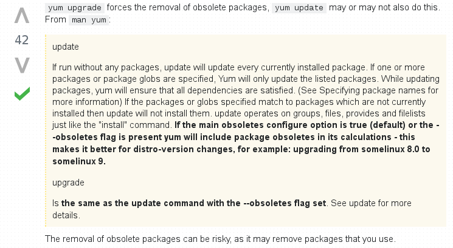

***********************
Package-Management
***********************

*Some useful links to cover the basics of Package-Management*

########
Concepts
########

- https://www.digitalocean.com/community/tutorials/package-management-basics-apt-yum-dnf-pkg
   
- https://blog.packagecloud.io/eng/2015/10/26/use-alien-to-convert-deb-to-rpm-and-rpm-to-deb/

Difference between yum update / yum upgrade
********************************************************

##########
RPM
##########

- https://rpmbuildtut.wordpress.com/development-packages/
   
- http://www.tldp.org/HOWTO/RPM-HOWTO/build.html
   
- https://fedoraproject.org/wiki/How_to_create_an_RPM_package
   
- http://www.tecmint.com/20-practical-examples-of-rpm-commands-in-linux/

YUM
********
- http://www.slashroot.in/yum-repository-and-package-management-complete-tutorial

- http://www.tecmint.com/20-linux-yum-yellowdog-updater-modified-commands-for-package-mangement/
   
- https://blog.packagecloud.io/eng/2015/04/05/yum-cheat-sheet/
 
- https://www.digitalocean.com/community/tutorials/how-to-set-up-and-use-yum-repositories-on-a-centos-6-vps
   
- http://www.rpm.org/max-rpm-snapshot/

DNF
********
- https://dnf.readthedocs.io/en/latest/index.html
   
- http://linoxide.com/linux-how-to/dnf-commands-manage-rpm-linux/

################
Configuration
################

- http://www.2daygeek.com/install-enable-rpm-fusion-repository-on-centos-fedora-rhel/

- http://www.tecmint.com/how-to-enable-epel-repository-for-rhel-centos-6-5/
   
- http://www.cyberciti.biz/tips/rhel5-fedora-core-add-new-yum-repository.html
   
- http://sharadchhetri.com/2014/02/22/yum-command-to-download-rpm-file-without-installing-in-linux-system/
   
- http://www.linuxtechi.com/download-rpm-using-yumdownloader-centos-7-rhel-7/
   
- https://blog.packagecloud.io/eng/2015/10/13/inspect-extract-contents-rpm-packages/
   

Rollback or Revert YUM Changes
****************************************
- https://www.if-not-true-then-false.com/2010/yum-history-list-info-summary-repeat-redo-undo-new/
   
- http://www.itechlounge.net/2012/08/linux-how-to-rollback-yum-updates-on-rhel-centos/
   
- http://www.cyberciti.biz/faq/howto-yum-downgrade-packages-on-rhel-centos-fedora-scientific-linux/

Downloading packages for RPM based OS
*********************************************
- https://pkgs.org/

Delta-RPMs
****************
• https://unix.stackexchange.com/questions/277900/do-i-need-to-do-something-about-delta-rpms-disabled

• https://www.certdepot.net/rhel7-get-started-delta-rpms/

################################   
Troubleshooting & Log Parsing
################################

- https://major.io/2007/05/27/rpmdb-lock-table-is-out-of-available-locker-entries/
   
- http://www.serveradminblog.com/2010/10/yum-problem-rpmdb-lock-table-is-out-of-available-locker-entries/
   
- http://www.if-not-true-then-false.com/2012/delete-remove-old-kernels-on-fedora-centos-red-hat-rhel/
   
- http://xmodulo.com/check-rpm-package-dependencies-fedora-centos-rhel.html
   
- http://xmodulo.com/how-to-fix-yum-errors-on-centos-rhel-or-fedora.html
   
- https://blog.packagecloud.io/eng/2015/04/20/working-with-source-rpms/

######
APT
######

- https://askubuntu.com/questions/18804/what-do-the-various-dpkg-flags-like-ii-rc-mean

- https://unix.stackexchange.com/questions/6284/check-package-version-using-apt-get-aptitude

- https://blog.packagecloud.io/eng/2015/03/30/apt-cheat-sheet/

- https://help.ubuntu.com/community/Repositories/CommandLine

- https://www.tecmint.com/useful-basic-commands-of-apt-get-and-apt-cache-for-package-management/

Configuration
*******************
- http://www.tecmint.com/apt-advanced-package-command-examples-in-ubuntu/

- http://www.cyberciti.biz/faq/debian-ubuntu-linux-show-detailed-description-info/
   
- https://blog.packagecloud.io/eng/2015/10/13/inspect-extract-contents-debian-packages/

Troubleshooting & Log Parsing
**************************************

Difference between apt-get update / apt-get upgrade
===========================================================

- https://askubuntu.com/questions/94102/what-is-the-difference-between-apt-get-update-and-upgrade

.. image::  ../source/images/package-mgmt-apt-upgrade-update.png
    :width: 745px
    :align: center
    :height: 264px
