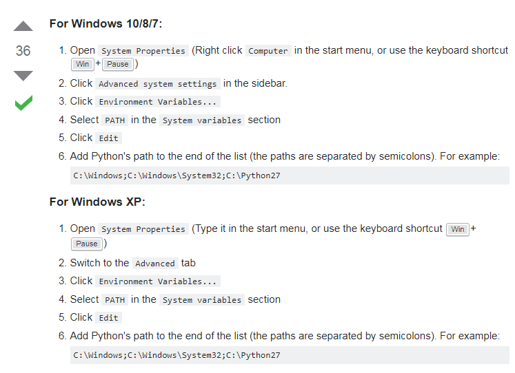

************
Python
************

*Some useful links to cover the basics of Python*

########
Concepts
########

- http://www.codeconquest.com/blog/the-50-best-websites-to-learn-python/
   
- http://simeonfranklin.com/python-fundamentals/
   
- https://python.zeef.com/yakup.keskindag
   
- https://www.tutorialspoint.com/python/index.htm 

Official Python Documentation
####################################
- https://docs.python.org/2/index.html
   
- https://docs.python.org/

Python Books
#########################

**A Byte of Python**
- https://python.swaroopch.com/
   
**Learn Python the Hard Way**
- https://learnpythonthehardway.org/book/
     

Online Courses
#########################
- https://www.codecademy.com/learn/python
   
- https://www.udacity.com/course/programming-foundations-with-python--ud036
   
- http://campus.codeschool.com/courses/try-python/level/1/section/1/video/1
   
- https://www.coursera.org/learn/python
   
- https://dev.to/jessicagarson/resources-for-learning-python-hd6

Intermediate Python
#########################
- http://book.pythontips.com/en/latest/
   
- https://automatetheboringstuff.com/
   
- https://gist.github.com/diyan/f3c24653e63c24c99137

Solving Python Problems to Learn Concepts
#############################################
- https://www.hackerrank.com/domains/python/py-introduction

#########################
Configuration
#########################
- http://aarvik.dk/python-for-system-administration/
   
- https://github.com/h2oai/h2o-2/wiki/installing-python-2.7-on-centos-6.3.-follow-this-sequence-exactly-for-centos-machine-only

- https://superuser.com/questions/143119/how-do-i-add-python-to-the-windows-path

        
- https://stackoverflow.com/questions/6318156/adding-python-path-on-windows-7?

.. image::  ../source/images/programming-python-env-windows-2.png
    :width: 723px
    :align: center
    :height: 321px
	
- https://techglimpse.com/error-executing-python3-5-command-solution/

- https://stackoverflow.com/questions/24205624/how-do-i-resolve-not-fully-installed-package-python3-setuptools

- https://stackoverflow.com/questions/38132755/importerror-no-module-named-encodings
   
Visual IDE for Python
#######################
- http://pythontutor.com/
   
- http://www.skulpt.org/
