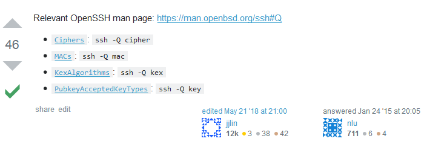

************
SSH
************

*Some useful links to cover the basics of SSH*

########
Concepts
########

- http://cavepopo.hd.free.fr/wordpress/linux/about-ssh-the-secure-shell/
   
- https://www.hostinger.com/tutorials/ssh-tutorial-how-does-ssh-work
   
- https://www.slashroot.in/secure-shell-how-does-ssh-work
   
- https://www.ibm.com/developerworks/aix/library/au-sshsecurity/index.html
   
- https://www.ibm.com/developerworks/library/l-keyc/index.html

- https://www.ssh.com/ssh/port

##########
Commands
##########

################
Configuration
################

SSH key-based logins
***********************
- https://www.digitalocean.com/community/tutorials/ssh-essentials-working-with-ssh-servers-clients-and-keys
   
- https://www.digitalocean.com/community/tutorials/how-to-configure-ssh-key-based-authentication-on-a-freebsd-server
   
- https://www.linode.com/docs/security/use-public-key-authentication-with-ssh

- http://blog.nowherelan.com/2014/01/04/two-step-authentication-for-ssh-on-centos-6-using-google-authenticator/

- https://www.linux.com/blog/securing-ssh-two-factor-authentication-using-google-authenticator

- http://www.thegeekstuff.com/2008/11/3-steps-to-perform-ssh-login-without-password-using-ssh-keygen-ssh-copy-id/

- https://www.digitalocean.com/community/tutorials/how-to-configure-custom-connection-options-for-your-ssh-client

- https://www.ssh.com/ssh/config/

################################   
Tuning & Hardening
################################

- https://superuser.com/questions/718346/openssh-ssh-config-host-specific-overrides-not-working
   
- https://www.digitalocean.com/community/tutorial_series/how-to-troubleshoot-ssh
   
- https://www.digitalocean.com/community/tutorials/how-to-tune-your-ssh-daemon-configuration-on-a-linux-vps

- https://stackoverflow.com/questions/10310299/proper-way-to-sudo-over-ssh

- https://security.stackexchange.com/questions/150540/is-it-completely-safe-to-publish-an-ssh-public-key

- https://hackerific.net/2017/04/23/ssh-audit---a-tool-for-checking-ssh-server-security/

- https://superuser.com/questions/868998/how-can-i-find-a-list-of-macs-ciphers-and-kexalgorithms-that-my-openssh-client

Correct permissions of .ssh directory
****************************************
- https://superuser.com/questions/215504/permissions-on-private-key-in-ssh-folder

.. image::  ../source/images/ssh-dot-dir-perms.png
    :width: 744px
    :align: center
    :height: 429px

Run same commands via SSH on multiple servers
*************************************************
- https://www.linux.com/news/parallel-ssh-execution-and-single-shell-control-them-all

- http://serverfault.com/questions/321167/add-correct-host-key-in-known-hosts-multiple-ssh-host-keys-per-hostname
    
- http://unix.stackexchange.com/questions/19008/automatically-run-commands-over-ssh-on-many-servers
   
- http://www.cyberciti.biz/tips/execute-commands-on-multiple-linux-or-unix-servers.html 
   
- http://unix.stackexchange.com/questions/107800/using-while-loop-to-ssh-to-multiple-servers
   
- http://stackoverflow.com/questions/20254906/bash-script-to-ssh-multiple-servers-in-a-loop-and-issue-commands
   
- http://unix.stackexchange.com/questions/182101/script-to-ssh-to-multiple-linux-server-and-execute-a-find-command
   
- http://cavepopo.hd.free.fr/wordpress/linux/ssh-the-secure-shell-practical-examples/
   
- http://thornelabs.net/2013/08/21/simple-ways-to-send-multiple-line-commands-over-ssh.html
   
- http://nerderati.com/2011/03/17/simplify-your-life-with-an-ssh-config-file/
   
- http://aarvik.dk/ssh-fundamentals-cssh-and-fabric/
   
- http://aarvik.dk/how-to-create-socks-proxy-through-ssh/

##########
TMux
##########

Some useful links to cover the working of TMux.
   
- https://danielmiessler.com/study/tmux/

- https://tmuxcheatsheet.com/
   
- http://lukaszwrobel.pl/blog/tmux-tutorial-split-terminal-windows-easily
   
- https://robots.thoughtbot.com/a-tmux-crash-course
     
- http://blog.hawkhost.com/2010/06/28/tmux-the-terminal-multiplexer/
   
- http://www.sitepoint.com/tmux-a-simple-start/
   
- http://fideloper.com/mac-vim-tmux
   
- http://blog.victorquinn.com/tmux-tutorial
   
- https://www.codementor.io/tmux/tutorial/beginners-guide-to-tmux-navigating-and-configuring-your-tmux
   
- https://marc.cortinasval.cat/blog/2013/11/29/tmux-the-best-choice/
   
- http://www.hamvocke.com/blog/a-guide-to-customizing-your-tmux-conf/

- https://github.com/rothgar/awesome-tmux

################################   
Troubleshooting & Log Parsing
################################

