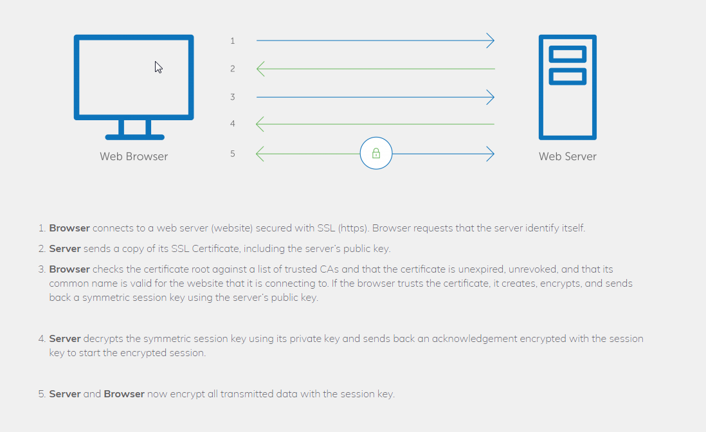

************
SSL
************

*Some useful links to explain the concepts of SSL*

########
Concepts
########

- https://tls.ulfheim.net

- https://www.digitalocean.com/community/tutorials/a-comparison-of-let-s-encrypt-commercial-and-private-certificate-authorities-and-self-signed-ssl-certificates

- https://scotthelme.co.uk/https-cheat-sheet/
   
- https://www.digicert.com/what-is-an-ssl-certificate

   
- https://www.digicert.com/kb/csr-creation.htm

- https://www.slashroot.in/understanding-working-secure-socket-layerssl
   
- https://www.slashroot.in/understanding-ssl-handshake-protocol

FAQs on SSL
#############

- https://timnash.co.uk/guessing-ssl-questions/

- https://dzone.com/articles/introduction-to-ssl-for-managers
   
- https://www.nutsandboltsmedia.com/does-your-website-really-need-ssl/

- https://www.slashroot.in/how-does-ssltls-chain-certificates-and-its-validation-work

- https://serverfault.com/questions/9708/what-is-a-pem-file-and-how-does-it-differ-from-other-openssl-generated-key-file

- https://www.troyhunt.com/life-is-about-to-get-harder-for-websites-without-https/

- https://www.troyhunt.com/on-the-perceived-value-ev-certs-cas-phishing-lets-encrypt/

- https://www.troyhunt.com/extended-validation-certificates-are-dead/

Server Name Indication
###########################
- https://cwiki.apache.org/confluence/display/httpd/NameBasedSSLVHostsWithSNI
   
- https://www.digicert.com/ssl-support/apache-multiple-ssl-certificates-using-sni.htm
 

################
Configuration
################

Basics of OpenSSL Commands for CSR, Keys & Certs
#######################################################
- https://www.digitalocean.com/community/tutorials/openssl-essentials-working-with-ssl-certificates-private-keys-and-csrs

- https://www.jamescoyle.net/how-to/1073-bash-script-to-create-an-ssl-certificate-key-and-request-csr
   
Wildcard SSL on sub-domain
##############################
- https://stackoverflow.com/questions/2115611/wildcard-ssl-on-sub-subdomain
   
- https://serverfault.com/questions/566426/does-each-subdomain-need-its-own-ssl-certificate
   
- https://serverfault.com/questions/104160/wildcard-ssl-certificate-for-second-level-subdomain

Switching from HTTP to HTTPs
##############################
- https://www.smashingmagazine.com/2017/06/guide-switching-http-https/
   
- http://searchengineland.com/http-https-seos-guide-securing-website-246940
   
- https://yoast.com/moving-your-website-to-https-ssl-tips-tricks/

Creating SAN SSL certificate
##############################
- https://geekflare.com/san-ssl-certificate/

#########################
Tuning & Hardening
#########################
- https://heartbleed.com/
   
- https://www.troyhunt.com/everything-you-need-to-know-about3/
 
- https://www.yahoo.com/tech/heres-what-you-need-to-know-about-the-heartbleed-bug-82120054478.html
   
- https://thehackernews.com/2014/04/heartbleed-bug-explained-10-most.html
   
- https://security.stackexchange.com/questions/8210/what-vulnerabilities-could-be-caused-by-a-wildcard-ssl-cert

- https://smallstep.com/blog/everything-pki/
   

Hardening Your Web Server SSL Ciphers
#############################################
- https://hynek.me/articles/hardening-your-web-servers-ssl-ciphers/

- https://ssl-config.mozilla.org/
 

##############################
Troubleshooting & Log Parsing
##############################
- https://www.sslshopper.com/ssl-certificate-tools.html

- https://cheapsslsecurity.com/ssltools/
   
- https://geekflare.com/best-ssl-checker/
   
- https://serversforhackers.com/c/self-signed-ssl-certificates
   
#############
Commands
#############
- https://www.sslshopper.com/article-most-common-openssl-commands.html

- https://www.experte.com/ssl-check/ 
   
Free SSL Certificates : LetsEncrypt
###################################
- https://www.digitalocean.com/community/tutorials/an-introduction-to-let-s-encrypt

- https://geekflare.com/free-ssl-tls-certificate/
   
- https://serversforhackers.com/video/letsencrypt-for-free-easy-ssl-certificates
   
- https://letsencrypt.org/
