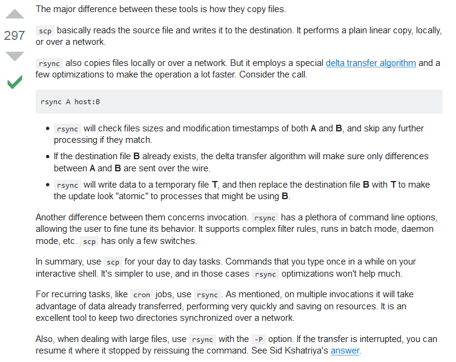
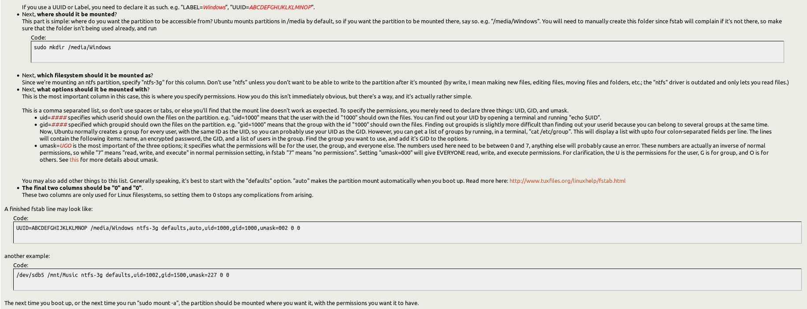

Storage
************

*Some useful links to explain the concepts of Storage, I/O*

########
Concepts
########

- https://linuxbsdos.com/2011/09/18/guide-to-disks-and-disk-partitions-in-linux/

- https://www.slashroot.in/linux-system-io-monitoring
   
- https://www.cyberciti.biz/tips/linux-disk-performance-monitoring-howto.html
  
- https://www.xmodulo.com/how-to-monitor-disk-io-in-linux.html
   
- https://www.cyberciti.biz/tips/freebsd-why-command-df-and-du-reports-different-output.html
 
- https://geek-university.com/etc-fstab-file/

######
GRUB
######

- https://linuxnorth.wordpress.com/2011/03/09/grub2-revisited/

- https://askubuntu.com/questions/2793/how-do-i-remove-old-kernel-versions-to-clean-up-the-boot-menu
 
- https://askubuntu.com/questions/218286/how-can-i-safely-remove-extra-grub-installs

######
LVM
######

- http://www.tecmint.com/create-lvm-storage-in-linux/
   
- https://www.cyberciti.biz/tips/fdisk-unable-to-create-partition-greater-2tb.html
   
- https://www.tecmint.com/parted-command-create-linux-partitions/
   
- https://www.thegeekstuff.com/2012/08/2tb-gtp-parted/
   
- https://www.thegeekstuff.com/2011/09/parted-command-examples/
   
- https://magicmonster.com/kb/os/linux/large_hdd/
   
- https://www.cyberciti.biz/tips/fdisk-unable-to-create-partition-greater-2tb.html

######
RAID
######
- https://www.slashroot.in/raid-levels-raid0-raid1-raid10-raid5-raid6-complete-tutorial
   
- https://www.tecmint.com/understanding-raid-setup-in-linux/
   
- https://www.thegeekstuff.com/2010/08/raid-levels-tutorial/
   
- https://www.thegeekstuff.com/2011/11/raid2-raid3-raid4-raid6/
   
- https://www.thegeekstuff.com/2011/10/raid10-vs-raid01/
   
- https://www.pugetsystems.com/labs/articles/RAID-Explained-24/

- https://wiki.archlinux.org/index.php/Software_RAID_and_LVM

- https://www.cyberciti.biz/tips/raid-hardware-vs-raid-software.html

############
GlusterFS
############

- https://www.interserver.net/tips/kb/what-is-glusterfs/

- https://www.slashroot.in/gfs-gluster-file-system-complete-tutorial-guide-for-an-administrator
   
- https://www.tecmint.com/introduction-to-glusterfs-file-system-and-installation-on-rhelcentos-and-fedora/
   
- https://www.digitalocean.com/community/tutorials/how-to-create-a-redundant-storage-pool-using-glusterfs-on-ubuntu-servers

- https://docs.gluster.org/en/latest/Quick-Start-Guide/Quickstart/

######
NFS
######
 
- https://www.cyberciti.biz/faq/mhddfs-linux-combines-a-several-mount-points-into-single-one/
   
- https://romanrm.net/mhddfs

- https://www.tecmint.com/how-to-setup-nfs-server-in-linux/

######
SCP
######
- https://www.tecmint.com/scp-commands-examples/

- https://www.binarytides.com/linux-scp-command/

######
Rsync
######
   
- https://www.linode.com/docs/tools-reference/tools/introduction-to-rsync
   
- https://www.tecmint.com/rsync-local-remote-file-synchronization-commands/
   
- https://www.thegeekstuff.com/2010/09/rsync-command-examples/
   
- https://www.howtogeek.com/175008/the-non-beginners-guide-to-syncing-data-with-rsync/
   
- https://www.techonthenet.com/linux/commands/rsync.php

- https://unix.stackexchange.com/questions/4712/rsync-two-file-types-in-one-command/4713#4713

- http://www.crucialp.com/resources/tutorials/server-administration/how-to-copy-files-across-a-network-internet-in-unix-linux-redhat-debian-freebsd-scp-tar-rsync-secure-network-copy/

- https://stackoverflow.com/questions/20244585/how-does-scp-differ-from-rsync/20257021#20257021

- https://unix.stackexchange.com/questions/4712/rsync-two-file-types-in-one-command/4713#4713

######
LsyncD
######
- https://lsyncd.github.io/lsyncd/

- https://www.lucasrolff.com/ha/replication-using-lsyncd/

Max User Watches Error of Lsyncd
=========================================
- https://xopo3o.blogspot.in/2015/11/how-to-lsyncd-error-consider-increasing.html
   
- https://unix.stackexchange.com/questions/13751/kernel-inotify-watch-limit-reached

.. image::  ../source/images/storage-backup-lsyncd-max-user.png
    :width: 778px
    :align: center
    :height: 948px

################
Configuration
################

- https://askubuntu.com/questions/109856/how-to-mount-a-windows-folder-in-linux

- https://access.redhat.com/solutions/448263
   
- https://www.tecmint.com/fdisk-commands-to-manage-linux-disk-partitions/
   
- https://www.thegeekstuff.com/2010/09/linux-fdisk/
 
- https://wiki.ubuntu.com/MountWindowsSharesPermanently

- https://www.cyberciti.biz/faq/linux-finding-using-uuids-to-update-fstab/
   
- https://codesilence.wordpress.com/2013/03/14/live-resizing-of-an-ext4-filesytem-on-linux/
   
- https://www.tecmint.com/parted-command-to-create-resize-rescue-linux-disk-partitions/

Good explanation fstab parameters
=====================================

- https://ubuntuforums.org/showthread.php?t=1604251

################################
Troubleshooting & Log Parsing
################################

- https://www.tecmint.com/linux-performance-monitoring-with-vmstat-and-iostat-commands/

- https://www.thegeekstuff.com/2011/07/iostat-vmstat-mpstat-examples/
   
- https://www.linode.com/docs/uptime/monitoring/use-vmstat-to-monitor-system-performance
   
- https://www.thomas-krenn.com/en/wiki/Linux_Performance_Measurements_using_vmstat
   
- https://www.thomas-krenn.com/en/wiki/SMART_tests_with_smartctl

- https://www.cyberciti.biz/hardware/linux-iotop-simple-top-like-io-monitor/

- https://blog.cloudflare.com/speeding-up-linux-disk-encryption/

Online Visual RAID Calculator
==================================
- https://www.synology.com/en-global/support/RAID_calculator
