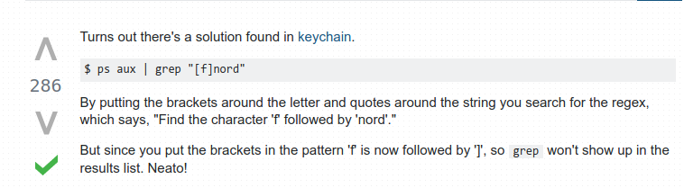
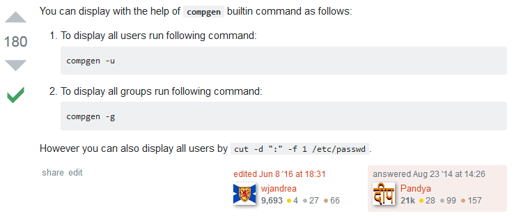
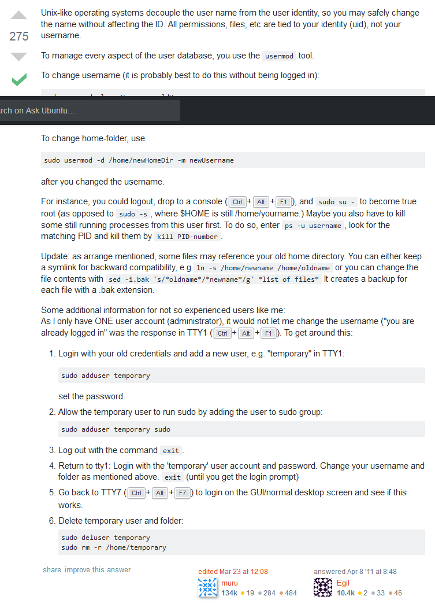
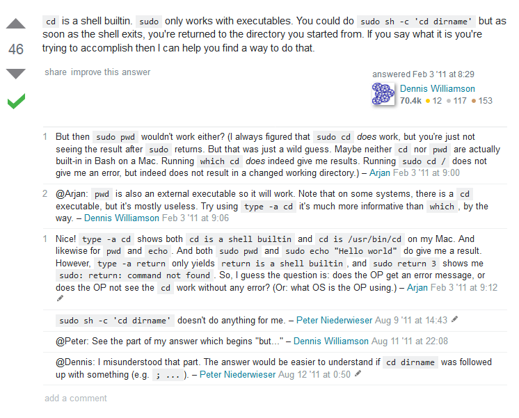
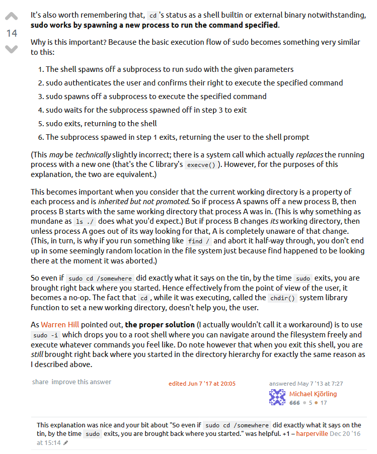
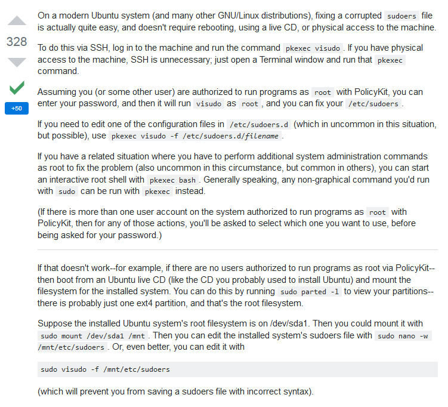
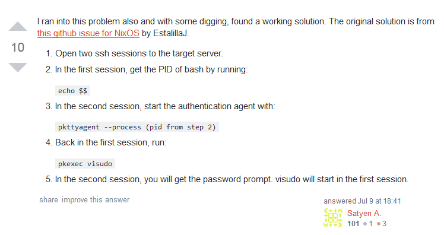
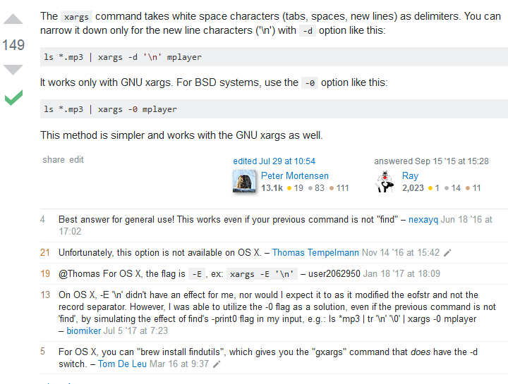
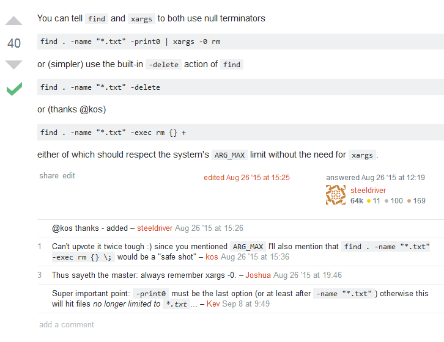

************
Utilities
************

################################
Environment Variables {ENV}
################################

*Some useful links to cover the basics of Environment Variables*

- https://www.guru99.com/linux-environment-variables.html

- https://www.digitalocean.com/community/tutorials/how-to-read-and-set-environmental-and-shell-variables-on-a-linux-vps

- https://www.slashroot.in/difference-between-bashrc-and-bashprofile

- https://www.cyberciti.biz/faq/linux-list-all-environment-variables-env-command/

#############
Crontab
#############

*Some useful links to cover the working of Crontab*

- http://www.thegeekstuff.com/2009/06/15-practical-crontab-examples/

- http://www.cyberciti.biz/faq/linux-show-what-cron-jobs-are-setup/

- https://www.pantz.org/software/cron/croninfo.html

.. image::  ../source/images/utilities-cron-syntax-1.png
    :width: 846px
    :align: center
    :height: 183px
        
- http://corntab.com/crontab_syntax

.. image::  ../source/images/utilities-cron-syntax-2.png
    :width: 1180px
    :align: center
    :height: 1953px

   
Online Utilities to generate crons
***********************************
- http://cronchecker.net/
   
- http://crontab-generator.org/
   
- http://www.cronmaker.com/
   
- http://htmlminifiers.com/cron-maker.php
   
- http://blog.endpoint.com/2008/12/best-practices-for-cron.html

########
GREP
########

*Some useful links to cover the working of Grep*

- https://www.linode.com/docs/tools-reference/search-and-filter-text-with-grep
   
- https://danielmiessler.com/study/grep/
   
- http://www.cyberciti.biz/faq/searching-multiple-words-string-using-grep/
   
- http://www.thegeekstuff.com/2011/10/grep-or-and-not-operators/
   
- http://xmodulo.com/how-to-grep-multiple-terms-or-strings.html
   
- https://www.digitalocean.com/community/tutorials/using-grep-regular-expressions-to-search-for-text-patterns-in-linux

- https://alvinalexander.com/unix/edu/examples/grep.shtml

- https://stackoverflow.com/questions/2427913/how-can-i-grep-for-a-string-that-begins-with-a-dash-hyphen

- https://stackoverflow.com/questions/221921/use-grep-exclude-include-syntax-to-not-grep-through-certain-files

- https://stackoverflow.com/questions/25853722/how-to-suppress-binary-file-matching-results-in-grep

Grepping ps output without showing the grep process
***************************************************************

- https://www.safaribooksonline.com/library/view/bash-cookbook/0596526784/ch17s18.html

- https://unix.stackexchange.com/questions/74185/how-can-i-prevent-grep-from-showing-up-in-ps-results

######
FIND
######

*Some useful links to cover the working of Find*

- https://danielmiessler.com/study/find/
   
- https://www.digitalocean.com/community/tutorials/how-to-use-find-and-locate-to-search-for-files-on-a-linux-vps
   
- http://tecadmin.net/delete-files-older-x-days/
   
- http://www.tecmint.com/find-and-sort-files-modification-date-and-time-in-linux/
   
- https://www.linode.com/docs/tools-reference/tools/find-files-in-linux-using-the-command-line

- https://alvinalexander.com/blog/post/linux-unix/find-how-multiple-search-patterns-filename-command

#######################
User Management
#######################

- https://www.linode.com/docs/tools-reference/linux-users-and-groups

- https://linux-audit.com/unused-linux-users-delete-or-keep/

- https://askubuntu.com/questions/515103/how-can-i-display-all-users-and-groups-with-a-command

- https://askubuntu.com/questions/34074/how-do-i-change-my-username

################
File Permissions
################

*Some useful links to cover the working of File Permissions*

- https://www.linux.com/learn/getting-know-linux-file-permissions
   
- http://www.penguintutor.com/linux/file-permissions-reference
   
- https://www.linux.com/learn/understanding-linux-file-permissions
   
- http://www.linuxnix.com/chmod-command-explained-linuxunix/
   
- https://unix.stackexchange.com/questions/21251/execute-vs-read-bit-how-do-directory-permissions-in-linux-work
   
- http://www.grymoire.com/Unix/Permissions.html
   
- http://www.thegeekstuff.com/2010/06/chmod-command-examples/
   
- https://danielmiessler.com/study/unixlinux_permissions/

- https://www.linux.com/learn/how-easily-back-and-restore-linux-file-permissions

- https://unix.stackexchange.com/questions/102286/ls-gives-no-such-file-or-directory-message

Why sudo cd <path-to-dir> doesn't work
***************************************************
- https://superuser.com/questions/241129/why-wont-sudo-cd-work

        
- https://askubuntu.com/questions/291666/why-doesnt-sudo-cd-var-named-work

        

Sudoers
*************
- http://cavepopo.hd.free.fr/wordpress/linux/sudo-command-sudoers-file-concepts-and-practical-examples/
   
- http://serverfault.com/questions/364334/test-whether-a-user-has-sudo-privileges-without-requiring-user-input
  
- https://www.digitalocean.com/community/tutorials/how-to-add-delete-and-grant-sudo-privileges-to-users-on-a-debian-vps
   
- http://www.thegeekstuff.com/2010/09/sudo-command-examples/
   
- https://www.garron.me/en/linux/visudo-command-sudoers-file-sudo-default-editor.html
   
- https://www.digitalocean.com/community/tutorials/how-to-edit-the-sudoers-file-on-ubuntu-and-centos

- https://askubuntu.com/questions/73864/how-to-modify-an-invalid-etc-sudoers-file

- https://askubuntu.com/questions/799669/etc-sudoers-file-corrupted-and-i-cant-run-pkexec-visudo-over-ssh

   
   
UserMod Command
**************************
- http://www.tecmint.com/usermod-command-examples/
   
- http://linoxide.com/linux-command/linux-usermod-command-to-modify-user-details/
   
- http://crybit.com/15-switches-of-usermod-command-with-example-unixlinux/
   
- https://muffinresearch.co.uk/linux-changing-uids-and-gids-for-user/
   
- http://www.htpcbeginner.com/safely-change-primary-group-group-in-linux/
   
- http://www.cyberciti.biz/faq/howto-linux-add-user-to-group/

SetUID and SetGID
**************************
- http://www.tutonics.com/2012/12/linux-file-permissions-chmod-umask.html
   
- https://www.slashroot.in/suid-and-sgid-linux-explained-examples

- https://www.thegeekstuff.com/2013/02/sticky-bit/

- http://www.linuxnix.com/suid-set-suid-linuxunix/

- https://unix.stackexchange.com/questions/28363/whats-the-difference-between-s-and-s-in-ls-la
   
UMask Values
************************
- → UMask contains default permissions for newly created files / directories based on base permissions for those
- → Base permissions for files is 666 (read-write permissions for owner-group-other : execute permissions are excluded by for files as security measure)
- → Similarly, the base permissions for directories are 777 (read-write-execute permissions for owner-group-other)
- → The UMask values are inverse to regular file permissions → i.e: chmod
- → UMask values = Base permissions - required permissions `All UMasks <https://www.linuxtrainingacademy.com/all-umasks/>`_
   
- https://www.computerhope.com/unix/uumask.htm

- http://www.cyberciti.biz/tips/understanding-linux-unix-umask-value-usage.html

- https://www.digitalocean.com/community/tutorials/linux-permissions-basics-and-how-to-use-umask-on-a-vps

##########
SymLinks
##########

*Some useful links to cover the working of SymLinks*

- http://www.cyberciti.biz/tips/understanding-unixlinux-symbolic-soft-and-hard-links.html
   
- http://www.thegeekstuff.com/2010/10/linux-ln-command-examples/
   
- http://bencane.com/2013/10/10/symlinks-vs-hardlinks-and-how-to-create-them/

- http://geek-university.com/linux/symbolic-links/
   
- http://geek-university.com/linux/hard-links/

##########
Others
##########

XArgs vs Exec
*********************

- http://unix.worldiswelcome.com/what-is-the-difference-between-exec-and-xargs
   
- https://danielmiessler.com/blog/linux-xargs-vs-exec/
   
- http://www.differencebetween.co.in/technology/difference-between-xargs-and-exec/

- https://stackoverflow.com/questions/16758525/make-xargs-handle-filenames-that-contain-spaces

- https://askubuntu.com/questions/666001/piping-find-name-to-xargs-results-in-filenames-with-spaces-not-being-passed-to/666004

 

NTP
**************
- http://support.ntp.org/bin/view/Support/TroubleshootingNTP
   
- https://support.rackspace.com/how-to/using-ntp-to-sync-time/
   
- https://www.ibm.com/support/knowledgecenter/en/ssw_aix_71/com.ibm.aix.cmds4/ntpdate.htm
   

Renaming / Deleting multiple files
******************************************
- http://www.cyberciti.biz/tips/renaming-multiple-files-at-a-shell-prompt.html
   
- http://tips.webdesign10.com/how-to-bulk-rename-files-in-linux-in-the-terminal
   
- https://www.linux.com/blog/linux-shell-tip-remove-files-names-contains-spaces-and-special-characters-such

- http://www.cyberciti.biz/faq/linux-bash-delete-all-files-in-directory-except-few/
   
- https://www.tecmint.com/delete-all-files-in-directory-except-one-few-file-extensions/
   
- https://askubuntu.com/questions/470134/how-to-find-the-creation-time-of-a-file

- https://www.if-not-true-then-false.com/2011/linux-display-show-file-contents-tabs-line-breaks-non-printing-characters/

Rename multiple files with different extensions
********************************************************
- https://superuser.com/questions/865826/linux-mv-command-for-moving-multiple-files-with-different-extensions

.. image::  ../source/images/utilities-mv-diff-ext.png
    :width: 755px
    :align: center
    :height: 409px
        

Command Prompt Tweaks
****************************
- http://computers.tutsplus.com/tutorials/speed-up-your-terminal-workflow-with-command-aliases-and-profile--mac-30515

- http://blog.taylormcgann.com/2012/06/13/customize-your-shell-command-prompt/

Random Tools
******************
- http://aarvik.dk/blacklist-check-unix-linux-utility/

- http://www.tecmint.com/progress-monitor-check-progress-of-linux-commands/

- http://www.tecmint.com/screen-command-examples-to-manage-linux-terminals/
   
- http://www.thegeekstuff.com/2009/04/chage-linux-password-expiration-and-aging/
   
- https://danielmiessler.com/study/tar/
   
- https://danielmiessler.com/blog/collection-of-less-commonly-used-unix-commands/

- http://www.commandlinefu.com/commands/browse

- https://distrochooser.de/en

- https://www.cyberciti.biz/open-source/command-line-hacks/compgen-linux-command/

- https://www.dynacont.net/documentation/linux/Useful_SystemD_commands/

#######
SysCTL
#######

*Some useful links to cover the working of SysCTL*

- http://go2linux.garron.me/linux/2011/02/introduction-and-how-sysctl-linux-900/
   
- http://www.slashroot.in/linux-network-tcp-performance-tuning-sysctl
   
- https://www.linux.com/news/kernel-tuning-sysctl
   
- https://www.cyberciti.biz/faq/linux-kernel-etcsysctl-conf-security-hardening/

#######
LSOF
#######

- https://danielmiessler.com/study/lsof/
   
- http://www.catonmat.net/blog/unix-utilities-lsof/
   
- http://www.thegeekstuff.com/2012/08/lsof-command-examples/
   
- https://www.ibm.com/developerworks/aix/library/au-lsof.html

- https://unix.stackexchange.com/questions/253321/how-to-display-size-human-readable-in-lsof-grep-var

##########
DIFF
##########
- https://www.lifewire.com/compare-two-text-files-linux-3861434

Comparing difference between files / directories on 2 servers
**********************************************************************
- http://xmodulo.com/how-to-diff-remote-files-over-ssh.html
   
- http://zuhaiblog.com/2011/02/14/using-diff-to-compare-folders-over-ssh-on-two-different-servers/
